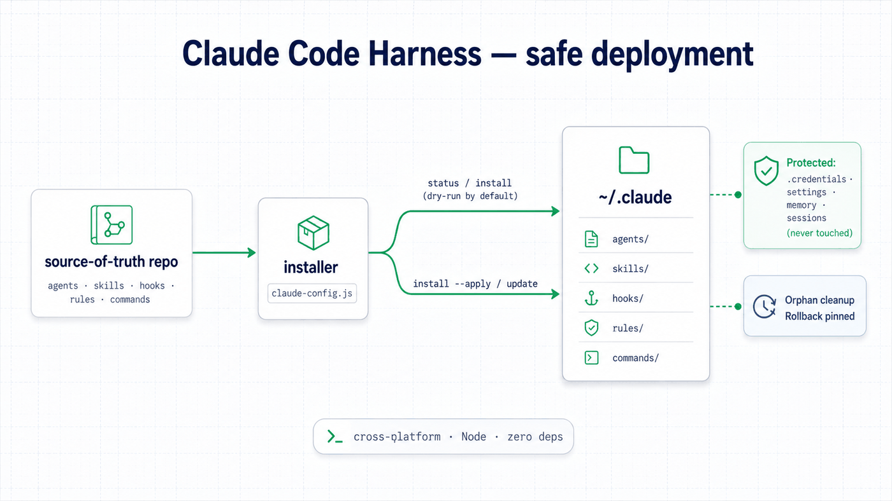

<div align="right"><a href="README.zh-CN.md">简体中文</a></div>

<p align="center"></p>

Claude Code Harness is the source-of-truth repository for a personal `~/.claude` setup — agents, skills, hooks, rules, and commands — deployed to Claude Code's global config directory by a single Node installer. It exists to make a large, evolving agent library reproducible across machines: one read-only health check, one command to deploy, and safe-by-default writes that never touch your credentials or sessions. The current library holds 37 agents, 52 commands, 31 skills, and 41 hooks.

## ✨ Highlights

- **Single cross-platform installer, zero dependencies** — one Node script that runs on Windows, macOS, and Linux using only the standard library.
- **Dry-run by default** — nothing is written until you pass `--apply`, so you can always preview the exact changes first.
- **Install vs. update** — `install` is incremental (fills gaps, skips existing files); `update` force-overwrites managed files.
- **Scoped orphan management** — cleanup is limited to managed directories, so unrelated files are left untouched.
- **Idempotent hook wiring** — hooks are matched by script basename per event, so re-running never duplicates wiring.
- **Strong config protection** — `.credentials.json`, `settings.json`, `memory`, `sessions`, and `projects` are never written or deleted.
- **Skill-visibility governance** — trims the skill listing to fit a ~1% context budget; on this library, 112 of 173 skill entries would otherwise be silently truncated.

## 🏗 Architecture

<p align="center"></p>
<p align="center"><sub>The repository is the source of truth; <code>claude-config.js</code> mirrors it into <code>~/.claude</code>, dry-run first.</sub></p>

The repository holds the library — agents, skills, hooks, rules, and commands — and the installer mirrors it into your global Claude Code config, then keeps the two in sync without ever clobbering local state. Every path through the installer starts read-only: `status` compares the repo against what is installed, and `install` reports the exact changes it would make until you pass `--apply`. Only `install --apply` and `update` write, the first incrementally and the second by force-overwriting managed files.

The green shield in the diagram marks what is out of bounds in every mode: `.credentials.json`, `settings.json`, `memory`, and `sessions` belong to your machine and are never written or deleted. The blue note covers the two housekeeping behaviours — orphan cleanup, which stays scoped to managed directories so unrelated files survive, and rollback, which is pinned to the repository as the single source of truth.

Everything runs through one script, `claude-config.js`:

- `status` — read-only health check comparing the repo against your installed config.
- `install` — incremental deploy that fills gaps and skips existing files (writes with `--apply`).
- `update` — force-overwrite managed files to match the repository.
- `wire` — idempotent hook wiring, matched by script basename per event.
- `export-profile` — export the current setup as a portable profile.

## 🧰 Tech stack

| Area | Details |
| --- | --- |
| Runtime | Node.js 18+ (the installer itself uses only Node-14-level syntax and the standard library — no npm dependencies) |
| Target | Claude Code global config directory (`~/.claude`) |
| Bridges | Ships bridges for other tools: `.cursor`, `.codex`, `.gemini` |

## 🚀 Getting started

Prerequisites: Node.js 18+.

```bash
# 1) Clone and run a read-only health check
git clone <repo> ~/.claude-config
cd ~/.claude-config
node claude-config.js status

# 2) Deploy (writes only with --apply)
node claude-config.js install --apply
```

## 🙏 Acknowledgements

This project builds on and is adapted from the open-source **everything-claude-code** project by **Affaan Mustafa** (MIT-licensed). Its structure and approach are indebted to that work; this repository adapts and extends it for a personal setup.

## 📄 License

MIT. This project inherits from and credits the MIT-licensed everything-claude-code upstream (see [Acknowledgements](#-acknowledgements)).

<p align="center"><sub>Built by <a href="https://github.com/SensLiao">Ruixuan "Sens" Liao</a> · USYD Advanced Computing (Honours)</sub></p>
