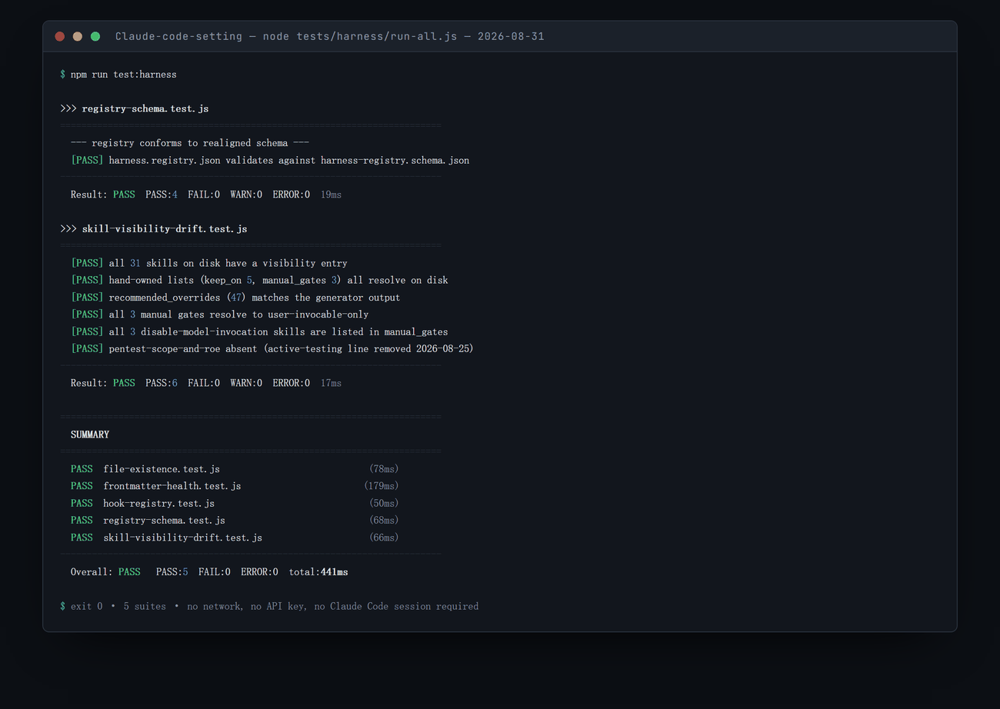

<div align="right"><a href="README.md">English</a></div>

<p align="center"></p>

<p align="center">
  
  
  
  
  
</p>

Claude Code Harness 是一套个人 `~/.claude` 配置的事实源仓库——智能体、技能、钩子、规则与命令——由一个 Node 安装器部署进 Claude Code 的全局配置目录。它的存在是为了让一个庞大且持续演进的智能体库在多台机器之间可复现：一条只读的健康检查、一条部署命令，以及默认安全的写入策略——绝不碰你的凭据、设置与会话。

<p align="center">
  <a href="#-快速开始">快速开始</a> ·
  <a href="#-安全模型">安全模型</a> ·
  <a href="#-常见工作流">常见工作流</a> ·
  <a href="#-安装器参考">安装器参考</a> ·
  <a href="#-库里有什么">库的内容</a>
</p>

## 🧭 概览

**问题。** 一套认真的 Claude Code 配置很快就不再是 dotfile，而是一个小型代码库：几十个智能体、命令与技能，接进 `settings.json` 的钩子，以及必须在每台机器上完全一致的规则。手工搬运会以两种特定方式出错。要么某次同步覆盖了那个必须留在本地的文件——你的凭据、这台机器的 `settings.json`、你的会话历史；要么它悄悄留下了一份过时副本，于是你花一个下午去调试一个仓库里早已不存在的钩子。

**方案。** 一个零依赖的 Node 脚本掌管整个生命周期，而每一处危险属性都是硬性规则而非习惯。**不加 `--apply` 就不会写入任何东西**——`status` 与 `install` 默认都是只读预览。一份 `PRESERVE` 清单让凭据、设置、记忆、会话与已安装插件在任何模式下都在结构上不可写。孤儿清理被限制在一份固定的受管目录清单内，因此安装器从未装过的文件也永远不会被它删除。钩子接线按事件内的脚本文件名匹配，因此重复运行是幂等的，而不是不断堆积重复项。

**范围。** 这是一个人的配置仓库，公开出来是为了让这套机制可被阅读与复用——它不是通用 dotfile 管理器，也不是插件市场。它部署到 `~/.claude`，为其他工具镜像保存桥接配置但并不部署它们，也不管理你的 Claude Code 本体安装。

## ✨ 亮点

- **单一跨平台安装器，零依赖** — 一个 Node 脚本，仅用标准库，在 Windows、macOS 与 Linux 上运行。
- **默认试运行** — 不加 `--apply` 就不写入任何内容，因此你总能先看到确切的变更集合。
- **install 与 update 是两份不同的契约** — `install` 是增量的（补齐缺失、跳过已存在文件）；`update` 强制覆盖受管文件并清理孤儿。
- **强配置保护** — `.credentials.json`、`settings.json`、`memory/`、`sessions/`、`projects/` 与 `plugins/` 在任何模式下都不写、不删。
- **孤儿清理有边界** — 删除被限制在受管目录内，因此 `~/.claude` 中无关的文件在 update 后原样存活。
- **幂等的钩子接线** — 钩子按事件内的脚本文件名匹配，因此重复运行 `wire` 绝不产生重复项，且它只做新增。
- **内建路径可移植性** — 文本资产携带 `__CLAUDE_HOME__` / `__USER_HOME__` 占位符，在部署时按机器替换，且同时提供 JSON 转义与原生路径两种形式。
- **技能可见性治理** — 一份生成的覆盖映射让技能列表保持在上下文预算内；在这个库上这件事很具体——不做裁剪的话，173 条技能条目中有 112 条会被静默截断。
- **状态可审计** — 一份 pin 文件记录了部署了什么、来自哪个 commit，因此 `status` 能逐文件告诉你 `SAME` / `STALE` / `MISSING` / `ORPHAN`，以及 `settings.json` 中任何失效的钩子引用。

## 🏗 架构

<p align="center"></p>
<p align="center"><sub>仓库是事实源；<code>claude-config.js</code> 把它镜像进 <code>~/.claude</code>，默认先试运行。</sub></p>

仓库持有这个库——智能体、技能、钩子、规则与命令——安装器把它镜像进你的全局 Claude Code 配置，并在此后保持两边同步，同时绝不覆盖本地状态。安装器的每条路径都从只读开始：`status` 把仓库与已安装内容做比对，而 `install` 在你加上 `--apply` 之前只会报告它将要做的确切变更。

图中那面绿色盾牌标出的是任何模式下都不可触碰的部分。蓝色注记覆盖两项日常维护行为——孤儿清理，被限制在受管目录内因而无关文件得以存活；以及回滚，锚定在仓库这一唯一事实源上。

## 🛡 安全模型

三份清单决定安装器可以碰什么，而且它们由代码强制执行，而不是交给操作者自觉：

| 清单 | 含义 | 内容 |
| --- | --- | --- |
| **PRESERVE** | 任何模式下都不写、不删 | `.credentials.json`、`settings.json`、`settings.local.json`、`memory/`、`projects/`、`sessions/`、`tasks/`、`history.jsonl`、`plugins/` |
| **SKIP** | 存在于仓库中但从不部署 | `README.md`、`CLAUDE.md`（本仓自身的契约）、`claude-config.js`、`wire-manifest.json`、`profiles/`，以及 `.cursor` / `.codex` / `.gemini` 桥接配置 |
| **MANAGED** | 孤儿清理唯一可以删除内容的目录 | `agents`、`commands`、`skills`、`hooks`、`scripts`、`rules`、`docs`、`manifests`、`schemas`、`templates`、`tools`、`workflows`、`mcp-servers`、`mcp-configs`、`orchestrator-runtime` |

有两个细节值得点明。第一，仓库自己的 `CLAUDE.md` 在 SKIP 中，而 `CLAUDE.global.md` 在部署时被重命名为 `CLAUDE.md`——正是这一点让本仓的维护契约不会覆盖掉你的全局行为规则。第二，一条用户所有权豁免保护本地生成的资产（learned 技能与个人钩子）以及 pin 文件中列出的任何内容，因此并非安装器装上去的材料不会被当作孤儿。

> [!NOTE]
> 面向 Cursor、Codex 与 Gemini 的桥接配置存放在这里只为备份与版本历史。那些工具从 `~/` 或项目根目录读取它们，而不是从 `~/.claude`，因此安装器刻意从不部署它们。

## 🚀 快速开始

### 环境要求

- **Node.js 18+**（安装器本身只用 Node-14 级语法与标准库——没有任何 `npm install`）
- 已安装 Claude Code，因而 `~/.claude` 存在

### 先看，再动

```bash
git clone <repo> ~/.claude-config
cd ~/.claude-config
node claude-config.js status
```

### 预期效果

`status` 完全只读。它会打印 `~/.claude/.config-source.json` 中 pin 住的已部署 commit 与仓库当前 HEAD 的对照，然后是逐文件比对结果，汇总为 `SAME` / `STALE` / `MISSING` / `ORPHAN`；接着是你 `settings.json` 中钩子引用的数量与其中失效的部分；最后是与默认 profile 的偏差。此刻磁盘上什么都没有改变。

### 部署

```bash
node claude-config.js install            # 仍是试运行——打印确切的执行计划
node claude-config.js install --apply    # 真正写入
```

`install` 是增量的：补齐缺失、跳过已存在的文件，随后分发技能可见性覆盖映射，并询问是否接线钩子。在非交互式 shell 中它绝不阻塞——而是打印出应当执行的 `wire` 命令。

## 📖 常见工作流

### 配置一台新机器

```bash
git clone <repo> ~/.claude-config && cd ~/.claude-config
node claude-config.js status             # 先看已有什么
node claude-config.js install --apply    # 部署所有缺失内容
node claude-config.js wire --apply       # 把钩子接进 settings.json
```

### 拉取最新库并强制重新同步

```bash
node claude-config.js update --pull --apply
```

`update` 会强制覆盖受管文件、删除受管目录内的孤儿、清理空目录并重新 pin。加 `--no-clean` 可保留孤儿；如果你更愿意自己管理 git，就去掉 `--pull`。

### 新增一个智能体或技能

把文件放进仓库的 `agents/`、`commands/` 或 `skills/`，提交，然后：

```bash
node claude-config.js install --apply    # 增量：加入新文件，其余一概不动
```

### 编辑清单后重新接线钩子

```bash
node claude-config.js wire --apply --hooks=A,B     # 只接指定批次
```

接线是幂等且只增不减的：按事件内脚本文件名匹配，绝不产生重复项，也绝不移除你手工添加的条目。

### 把当前机器导出为 profile

```bash
node claude-config.js export-profile default --apply
```

实际的钩子路径会被模板化回 `__CLAUDE_HOME__` / `__NODE_BIN__` / `__USER_HOME__`，因此导出的 profile 可移植到另一台机器。

### 部署到别处（或安全试验）

```bash
node claude-config.js install --target /tmp/claude-test --apply
```

## 🧾 安装器参考

一切都通过 `claude-config.js` 一个脚本运行。默认命令是 `status`，默认模式是试运行。

| 命令 | 作用 |
| --- | --- |
| `status` | 只读健康检查：pin 住的 commit 与 HEAD 对照、逐文件 `SAME`/`STALE`/`MISSING`/`ORPHAN`、钩子引用数量与失效项、profile 偏差。 |
| `install` | 增量部署——补齐缺失、跳过已存在文件，随后分发技能覆盖映射并询问是否接线钩子。 |
| `update` | 强制覆盖受管文件、删除孤儿（除非 `--no-clean`）、清理空的受管目录、重新 pin。 |
| `wire` | 把清单中的钩子（重新）接进 `settings.json`。幂等，按事件内文件名匹配，只增不减。 |
| `skills` | 把推荐的技能可见性覆盖映射分发进 `settings.json`，写入前先备份原文件。 |
| `export-profile [name]` | 把当前接线的钩子写入 `profiles/<name>.json`，并把机器路径模板化。 |

| 参数 | 效果 |
| --- | --- |
| `--apply` | 真正写入。**不加它时，每条命令都是试运行。** |
| `--no-clean` | 执行 `update` 时保留孤儿而非删除。 |
| `--pull` | 部署前：有改动则 stash、fetch、快进 pull、再恢复。 |
| `--target DIR` | 部署到 `~/.claude` 以外的位置。 |
| `--wire` / `--no-wire` / `--hooks=A,B` | 非交互式地控制钩子接线；`--hooks` 隐含 `--wire`。 |
| `--yes` | 接受默认值，不再询问。 |

交互式提示只在 TTY 下出现，因此无人值守与代理驱动的运行绝不会被卡住。

## 📦 库里有什么

| 资产 | 数量 | 形态 |
| --- | --- | --- |
| **智能体** | 37 | 分语言评审者（TypeScript、Python、Go、Rust、Java、Kotlin、C++、C#、Flutter、数据库、医疗）、按工具链划分的构建错误修复者、规划与架构智能体、UI/UX 评审者、开源打包三件套，以及 harness/元层智能体。每一个都显式声明所用模型。 |
| **命令** | 52 | 规划与执行（`plan`、`lite-plan`、`lite-execute`）、评审与质量门禁、会话保存/恢复、一套 PRP 工作流、学习与技能创作，以及分语言的构建/评审/测试三件组。 |
| **技能** | 31 | 一个 UI/UX 簇（1 个基础技能、6 个互斥的主风格、5 个工作流技能、7 个设计系统技能）、代码理解技能、跨模型分派、2 个技能/工作流制造器，以及 8 个通用工具。索引见 [`SKILLS-INDEX.md`](SKILLS-INDEX.md)。 |
| **钩子** | 5 已接线，3 休眠 | 已接线：拦截 `--no-verify` 提交、把实质性回合自动记入运行账本、保护 linter/formatter 配置不被削弱、自动格式化被编辑的文件、对趋于模板化的前端 UI 发出提醒。休眠项通过清单按需启用。 |
| **MCP** | 28 份配置 + 1 个自带服务器 | 一份带占位凭据、可复制粘贴的 MCP 服务器定义目录，外加一个完整的 TypeScript XMind MCP 服务器（8 个工具、6 种格式转换器）。 |

技能是被治理的，而不是一股脑堆进去：一份生成的覆盖映射为每个技能指派 `on`、`name-only`、`user-invocable-only` 或 `off`，因为技能的名称与描述会进入每一次上下文，而这个列表有预算。在这个库上这件事很具体——不做裁剪的话，173 条技能条目中有 112 条会被静默截断。一个漂移测试守着这份映射不越过预算。

## 🗺 仓库地图

| 路径 | 内容 |
| --- | --- |
| [`claude-config.js`](claude-config.js) | 整个安装器——一个文件，零依赖 |
| [`agents/`](agents/) · [`commands/`](commands/) · [`skills/`](skills/) | 会被部署的库本体 |
| [`hooks/`](hooks/) · `scripts/hooks/` | 钩子实现；由 `wire-manifest.json` 决定哪些被接线 |
| [`manifests/`](manifests/) | 钩子注册表、harness 注册表，以及技能可见性覆盖映射 |
| [`mcp-configs/`](mcp-configs/) · [`mcp-servers/`](mcp-servers/) | MCP 服务器目录与自带的 XMind 服务器 |
| [`orchestrator-runtime/shared/`](orchestrator-runtime/shared/) | 运行账本、git 上下文助手、计划预览卡模板 |
| [`tests/harness/`](tests/harness/) | 漂移测试：文件存在性、frontmatter 健康度、钩子注册表 lint、注册表 schema、技能可见性预算 |
| [`docs/`](docs/) | 运作原则、原生能力笔记、兼容性矩阵、模型提供方可移植性 |
| `CLAUDE.global.md` | 被部署为 `~/.claude/CLAUDE.md` 的全局行为规则 |
| [`CLAUDE.md`](CLAUDE.md) | 本仓库自身的维护契约——永不部署 |

## 🧪 测试

```bash
npm run test:harness
```

harness 套件会发现 `tests/harness/` 下的每个 `*.test.js`，各自在独立 Node 进程中运行并汇总结果：全部通过退出 `0`，出现漂移退出 `1`，基础设施错误退出 `2`。`--bail` 在首次失败处停止，`-q` 静默输出。五个套件分别检查：每个规范文件是否存在；智能体与技能的 frontmatter 是否可解析（描述损坏会让技能被静默降级为 name-only）；钩子注册表是否通过 lint；harness 注册表是否符合其 schema；以及技能可见性映射是否漂移出预算。

<p align="center"></p>

<p align="center"><sub>在干净检出上的真实运行——不需要网络、不需要 API key、也不需要 Claude Code 会话。漂移检查才是重点：<code>skill-visibility-drift</code> 会读取磁盘上全部 31 个技能，断言生成出来的 47 条 override 列表仍然吻合，所以"新增了技能却没做可见性决策"会让构建失败，而不是悄悄发布出去。</sub></p>

## 📚 文档

- [`docs/OPERATING-PRINCIPLES.md`](docs/OPERATING-PRINCIPLES.md) — 为什么这套 harness 围绕稀缺的"判断力"来组织，以及评审节奏与准入标准
- [`docs/native-capabilities.md`](docs/native-capabilities.md) — Claude Code 原生提供什么，附把"会话已确认"与"文档引用"分开的置信度标记；技能列表预算的出处
- [`docs/cc-compat-matrix.md`](docs/cc-compat-matrix.md) — 按接口面划分的版本下限，保护钩子、settings 键与技能不受上游变更冲击，附只追加的破坏性变更日志
- [`docs/provider-portability.md`](docs/provider-portability.md) — 哪些东西绑定 Claude Code、哪些绑定模型，以及如何更换提供方
- [`SKILLS-INDEX.md`](SKILLS-INDEX.md) — 每个技能一行的索引（刻意不自动加载；需要时主动读它）

## 🖥 兼容性

| 组件 | 支持情况 |
| --- | --- |
| Node.js | 18+（脚本本身是 Node-14 级语法，仅用标准库） |
| 操作系统 | Windows、macOS、Linux——路径处理与占位符覆盖三者 |
| 目标 | Claude Code 全局配置目录，默认 `~/.claude`，可用 `--target` 覆盖 |
| 其他工具 | Cursor、Codex 与 Gemini 的桥接配置在此版本化保存，但从不部署 |

## 📊 项目状态

- **稳定** — 安装器及其安全模型：默认试运行、PRESERVE 保护、有边界的孤儿清理、幂等接线、占位符替换、pin 与 profile 导出。这是最值得读的部分。
- **持续变动中** — 库本体。2026 年 8 月移除了一整层编排机制，并用一个快照 tag 标记了移除前的状态；当前形态刻意更简单：工具型技能与通用智能体按名调用，而不是自动触发的管线。
- **继承来的元数据，不具权威性** — `plugin.json` 与 `marketplace.json` 来自本仓库改编所依据的上游项目，其中的计数描述的是那个项目而不是这个库。`AGENTS.md` 同理。
- **已知粗糙处** — 若干 `test:harness:*` npm 别名仍指向随编排层一并移除的套件（`npm run test:harness` 本身可用，请用它），并且尚未提交 `LICENSE` 文件。

## 🙋 获取帮助

- **部署之前** — 先跑 `status`，再读不加 `--apply` 时 `install` 打印出的计划。若看着不对，那它还没有发生。
- **恢复** — 仓库就是回滚路径：检出任意 commit 后重跑 `update --apply`。另有一个 pre-orchestrator tag 可用于整体退回。
- **Bug** — 提交 GitHub issue，附上操作系统、Node 版本、确切命令与 `status` 输出。

## 🙏 致谢

本项目构建于并改编自 **Affaan Mustafa** 的开源项目 **everything-claude-code**（MIT 许可）。其结构与思路受惠于那项工作；本仓库在此基础上为个人配置做了改编与扩展。

## 📄 许可证

MIT。本项目继承并致谢 MIT 许可的 everything-claude-code 上游（见[致谢](#-致谢)）；承载该署名的 `LICENSE` 文件尚未提交到本仓库。

<p align="center"><sub>由 <a href="https://github.com/SensLiao">Ruixuan "Sens" Liao</a> 构建 · 悉尼大学 Advanced Computing（Honours）</sub></p>
