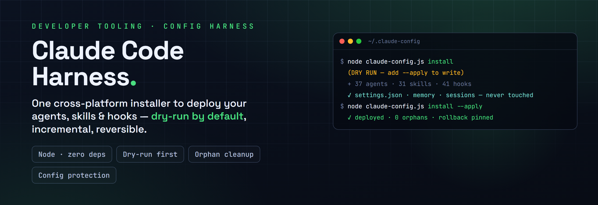

<div align="right"><a href="README.md">English</a></div>

<p align="center"></p>

<p align="center"><b>一个跨平台安装器，安全地部署你的 Claude Code agents、skills 与 hooks。</b></p>

<p align="center">


</p>

Claude Code Harness 是一套个人 `~/.claude` 配置（agents、skills、hooks、rules 与 commands）的唯一可信来源仓库，通过单个 Node 安装器部署到 Claude Code 的全局配置目录。它的目标是让一个庞大且持续演进的 agent 库能够在多台机器之间可复现地重建：一条只读的健康检查命令、一条部署命令，以及默认安全、绝不触碰你的凭据与会话的写入方式。

## ✨ 亮点特性

- **单一跨平台安装器，零依赖** —— 一个 Node 脚本，仅使用标准库即可在 Windows、macOS 与 Linux 上运行。
- **默认 dry-run** —— 在传入 `--apply` 之前不会写入任何内容，因此你始终可以先预览确切的改动。
- **install 与 update 之分** —— `install` 为增量式（补齐缺失、跳过已存在文件）；`update` 则强制覆盖受管文件。
- **受限的孤儿文件治理** —— 清理仅限于受管目录，因而与之无关的文件不会被动到。
- **幂等的 hook 挂载** —— hook 按每个事件的脚本 basename 进行匹配，因此重复运行不会造成重复挂载。
- **强力的配置保护** —— `.credentials.json`、`settings.json`、`memory`、`sessions` 与 `projects` 永远不会被写入或删除。
- **skill 可见性治理** —— 将 skill 清单裁剪到约 1% 的上下文预算之内；在本库中，若不裁剪，173 条 skill 条目中会有 112 条被静默截断。

## 🏗 工作原理

仓库是唯一可信来源；安装器将其镜像到你的全局 Claude Code 配置中，并在此后保持两者同步，同时绝不破坏本地状态。当前库包含 **37 个 agents、52 个 commands、31 个 skills 与 41 个 hooks**。

所有操作都通过单个脚本 `claude-config.js` 完成：

- `status` —— 只读健康检查，将仓库与你已安装的配置进行比对。
- `install` —— 增量部署，补齐缺失并跳过已存在文件（配合 `--apply` 写入）。
- `update` —— 强制覆盖受管文件，使其与仓库一致。
- `wire` —— 幂等的 hook 挂载，按每个事件的脚本 basename 匹配。
- `export-profile` —— 将当前配置导出为可移植的 profile。

## 🧰 技术栈

| 领域 | 说明 |
| --- | --- |
| 运行时 | Node.js 18+（安装器本身仅使用 Node 14 级别语法与标准库 —— 无 npm 依赖） |
| 目标 | Claude Code 全局配置目录（`~/.claude`） |
| 桥接 | 为其他工具提供桥接：`.cursor`、`.codex`、`.gemini` |

## 🚀 快速开始

前置条件：Node.js 18+。

```bash
# 1) 克隆并运行只读健康检查
git clone <repo> ~/.claude-config
cd ~/.claude-config
node claude-config.js status

# 2) 部署（仅在 --apply 时写入）
node claude-config.js install --apply
```

## 📌 项目状态

该库于 2026 年 8 月被有意精简：移除了一个较重的编排（orchestration）层，并以快照标签 `pre-orchestrator-removal` 记录了移除前的状态。

## 🙏 致谢

本项目基于并改编自 **Affaan Mustafa** 的开源项目 **everything-claude-code**（MIT 许可）。其结构与思路得益于该项目；本仓库在此基础上针对个人配置进行了适配与扩展。

## 📄 许可证

MIT。本项目继承自并致谢采用 MIT 许可的 everything-claude-code 上游项目（见[致谢](#-致谢)）。

<p align="center"><sub>由 <a href="https://github.com/SensLiao">Ruixuan "Sens" Liao</a> 构建 · USYD Advanced Computing (Honours)</sub></p>
