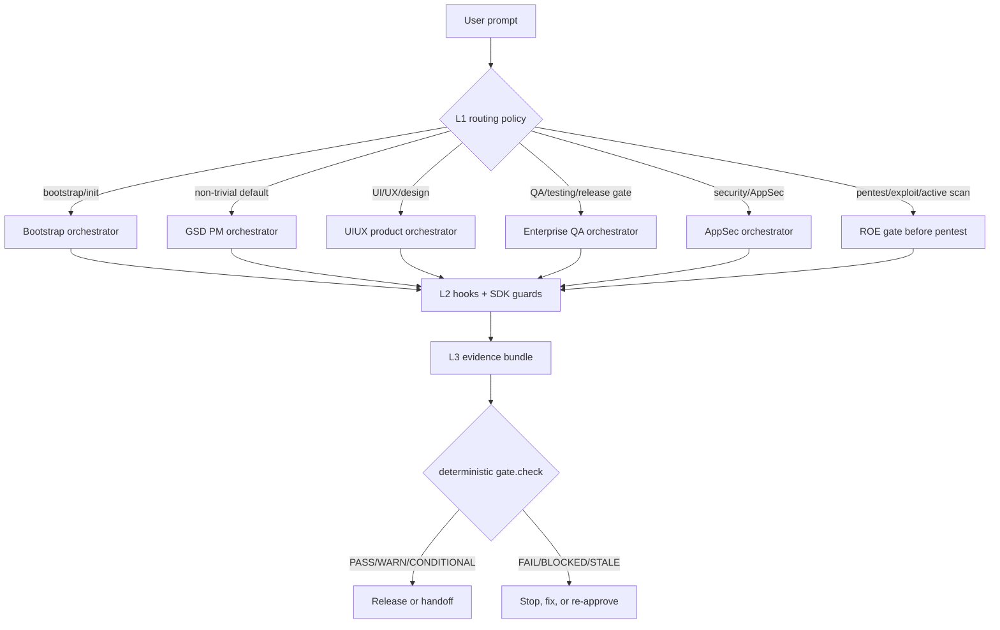
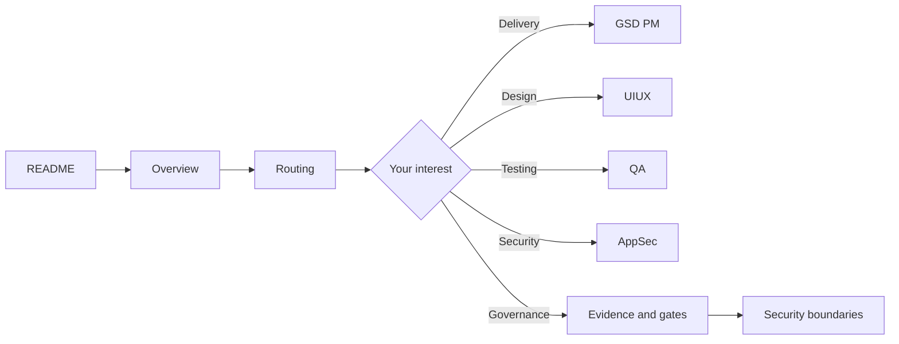

# Agentic Delivery Orchestration Architecture

> 一个把 **环境 Bootstrap、GSD 交付、UI/UX、QA、AppSec 与安全渗透边界** 串成可审计工程流程的五主线 orchestrator 架构。

这个仓库不是普通功能库，而是一个 **架构展示仓库**：用 README 让访问者在 30 秒内看懂全局，用 `docs/` 解释每条主线，用 `diagrams/` 保存 Mermaid 源图，用 `data/` 保存机器可读矩阵，用 `examples/` 展示证据产物的真实形状。

## 30 秒看懂

5 条主线、4 层控制面、1 条核心治理原则。可信度不来自"模型更聪明"，而来自 **hooks + 确定性 gate + spec_hash + evidence bundle + 人工签字**。

| 维度 | 内容 |
|---|---|
| 5 条主线 | Bootstrap · GSD PM · UIUX `v2.3` · QA `v3.2` · AppSec `v3.0` |
| 4 层堆叠 | L0 沟通层 · L1 路由层 · L2 Hook 执行强制层 · L3 证据/门禁层 |
| 默认路由 | 含糊/非 trivial → GSD；设计 → UIUX；测试 → QA；安全 → AppSec；主动渗透永远先过 ROE |
| 硬约束 | `context loading != enforcement`，强制来自 hooks、deterministic gate、spec_hash、evidence bundle、人工签字 |
| 发布裁决 | `PASS` / `WARN` / `FAIL` / `BLOCKED` / `CONDITIONAL_PASS` / `STALE` / `STRATEGY_READY` |
| 标准底座 | OWASP ASVS 5.0 · OWASP Top 10:2025 · NIST CSF 2.0 · WCAG 2.2 · ISO/IEC 25010:2023 · PCI DSS 4.0.1 · MITRE ATT&CK |



## 为什么这个架构值得展示

它解决的不是"让 AI 多做一点事"，而是这些工程问题：

1. **复杂任务如何路由**：不同任务进入不同主线，避免所有需求落进一个万能 agent。
2. **模型输出如何被治理**：模型可以建议、发现、归纳，但发布裁决必须来自确定性门禁和证据。
3. **设计、测试、安全如何衔接**：UIUX 下游接 QA 和 AppSec；GSD ship 前需要 QA/AppSec 证据；QA 碰到安全域转 AppSec。
4. **主动安全测试如何不越界**：pentest 永远 manual-only，先 ROE，再授权，再执行；生产 host 即使有 ROE 也硬拒。
5. **文档如何不腐烂**：图、表、YAML、证据样例分开维护，reviewer 可快速校验 drift。

## 主线总览

| 主线 | 版本 | 触发 | 模式 | 规模 | 关键门禁 | 代表产物 |
|---|---|---|---|---|---|---|
| **Bootstrap** | — | `init` / 安装环境 / `.claude/` 不存在 | 手动 6 步（manual-first） | 信号扫描 25+8 · selector-engine | preflight · proposal · verify | `manifest.json` · `CLAUDE.md` · 子系统 hooks |
| **GSD PM** | — | 复杂交付 / 默认兜底 | Tier 1-4 · SKILL-direct | 8 分类 flag · ~68 skill · 33 agent | plan preview · review convergence · ship gate | PLAN / REVIEW / VERIFICATION / PR / learnings |
| **UIUX** | `v2.3` | UI/UX / 设计 / 风格 / 截图还原 | 6-phase engine · SKILL-direct | L0–L8+P 层 · 3 L3 互斥风格 · 6 lens · 1 桥 agent | grounding · style lock · mechanical unify · review loop | `design/grounding.md` · `.uiux/lock/style-lock.yaml` · `uiux_release_decision.yaml` |
| **QA** | `v3.2` | 测试 / E2E / release readiness / CI 门禁 | dual-mode：prompt-only 9 步 / workflow-spec 14 步 | 9 测试层 + 4 横切 · 13 child-skill · 3+6 agent · 4 preset | risk classifier · evidence validator · release gate | `qa_evidence_bundle.yaml` · `release_decision` |
| **AppSec** | `v3.0` | 安全 / auth / secret / API / LLM / IaC / payment | dual-mode：prompt-only §16 / workflow-spec 14 步 | 6 能力层→CSF2.0 · 18 sub-skill · 5 agent · 10 hook · ~22 SDK cmd | classifier · finding schema · ASVS/CSF mapping · gate.check | `findings/*.yaml` · `appsec_release_decision.yaml` |

> L12 Discoverability（SEO / AEO=GEO / Local SEO / ASO）是 UIUX 下游的 release gate，不是第 6 条主线 —— 见 [`docs/02-orchestrators/uiux.md`](docs/02-orchestrators/uiux.md)。

## 仓库导航

| 入口 | 适合谁看 | 内容 |
|---|---|---|
| [`docs/00-overview.md`](docs/00-overview.md) | 第一次看架构的人 | 5 主线、4 层堆叠、核心原则 |
| [`docs/01-routing.md`](docs/01-routing.md) | 想理解 prompt 如何进主线的人 | 路由策略、优先级、tie-break、handoff |
| [`docs/02-orchestrators/`](docs/02-orchestrators/) | 想看每条 workflow 的人 | Bootstrap / GSD / UIUX / QA / AppSec 深挖到 agent·hook·SDK 级 |
| [`docs/03-capability-matrix.md`](docs/03-capability-matrix.md) | 想看"测什么/防什么/攻什么"的人 | QA 9 层 + 工具/标准、AppSec 域 + 标准、offensive 边界 + 5 把锁 |
| [`docs/04-governance-and-evidence.md`](docs/04-governance-and-evidence.md) | 想看门禁和证据链的人 | verdict、spec_hash、evidence schema、dynamic workflow 边界 |
| [`docs/05-security-boundaries.md`](docs/05-security-boundaries.md) | 想确认安全边界的人 | ROE、授权、禁止项、active scan guard |
| [`docs/06-presenting-this-architecture.md`](docs/06-presenting-this-architecture.md) | 想把它展示给别人的人 | GitHub 展示策略、reviewer 阅读路径 |
| [`data/`](data/) | 想机器读取的人 | orchestrator / capability / verdict YAML |
| [`examples/evidence/`](examples/evidence/) | 想看产物格式的人 | QA / AppSec / UIUX release decision 示例 |

## 核心原则

### 1. Context loading is not enforcement

把规则写进 `CLAUDE.md`、skills、prompts、manifests 只是加载上下文；真正的强制来自 hooks（`PreToolUse` `exit 2` 硬阻断）、SDK command、确定性 gate 和人工签字。这是 **ORACLE-001** 原则，Bootstrap 的 VERIFY 步会硬校验 hooks 是否真的注册进 `settings.json`。

### 2. Governed gate 不让动态 workflow 直接裁决

动态 workflow / ultracode 只能当侦察兵：生成候选发现、风险草案、检查建议。它**不能**直接给 release verdict。最终裁决只允许来自：

```text
spec_hash 人工签字 + deterministic runner + evidence bundle + gate.check
```

`allow_dynamic_workflow` 字段默认 `false`，governed preset 必须 `false`，且该字段进 `spec_hash` —— preview-gate 见 `true` 直接拒。

### 3. Offensive capability 永远 manual-only

被动 baseline scan 可自动化；主动 pentest 必须先过 ROE、必须在授权窗口内、必须目标在 scope 内、必须逐字签字。生产 host 即使有 ROE 也硬拒。共 **5 把独立锁**（详见 `docs/05-security-boundaries.md`）。

## 标准对齐（Standards Alignment）

这套架构不是贴标签，而是把每条 finding / 每个 gate 绑定到版本化的行业标准：

| 域 | 标准 | 落点 |
|---|---|---|
| 应用安全验证 | **OWASP ASVS 5.0**（V1–V17） | AppSec finding `asvs_mapping` · code review · `control.coverage` |
| Web / API / LLM 风险 | OWASP Top 10:2025 · API Top 10:2023 · LLM Top 10 (+Agentic) · WSTG · MASVS 2.x | AppSec overlay skills + finding 字段 |
| 安全框架 | **NIST CSF 2.0**（GV/ID/PR/DE/RS/RC 六功能） | 6 能力层映射 · `csf.coverage` · 证据完整性 gate |
| 供应链 / SSDF | NIST SP 800-218 · SLSA · SBOM(SPDX/CycloneDX) · CIS Controls v8.1 | `security-platform-supply-chain` |
| 对抗 / 检测覆盖 | MITRE ATT&CK | `security-response-red-purple-team`（planning-only）· `attack.coverage` |
| 合规 | PCI DSS 4.0.1 · PIPL · GDPR/CCPA/CPRA | `security-compliance-*` |
| 质量 / 可访问性 / 性能 | WCAG 2.2 · Core Web Vitals · ISO/IEC 25010:2023 | QA `qa-a11y-compliance` / `qa-performance-reliability` |

## 推荐阅读路径



## 文件结构

```text
.
├── README.md
├── CONTRIBUTING.md
├── docs/
│   ├── 00-overview.md
│   ├── 01-routing.md
│   ├── 02-orchestrators/
│   │   ├── bootstrap.md        # 6-step selector-engine
│   │   ├── gsd-pm.md           # Tier 1-4 · 8 flags · ~68 skill / 33 agent
│   │   ├── uiux.md             # 6-phase engine · L3 mutex · L12 downstream
│   │   ├── qa.md               # 9 test layers · risk model · 4 presets
│   │   └── appsec.md           # §16 / 14-step · CSF 2.0 · 18 sub-skill
│   ├── 03-capability-matrix.md
│   ├── 04-governance-and-evidence.md
│   ├── 05-security-boundaries.md
│   ├── 06-presenting-this-architecture.md
│   └── glossary.md
├── diagrams/                   # Mermaid 源图 (.mmd)
├── data/                       # orchestrators / capability-matrix / verdicts (.yml)
└── examples/evidence/          # release decision 样例 (.yaml)
```

## 适合放在 GitHub 首页的展示方式

首页只讲三件事：

1. **这是什么**：五主线 orchestrator 架构。
2. **为什么可信**：hooks + evidence + deterministic gate + manual approval + 版本化标准对齐。
3. **从哪里继续看**：按角色给出阅读路径。

更多展示建议见 [`docs/06-presenting-this-architecture.md`](docs/06-presenting-this-architecture.md)。
