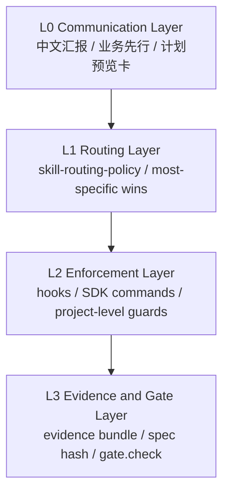
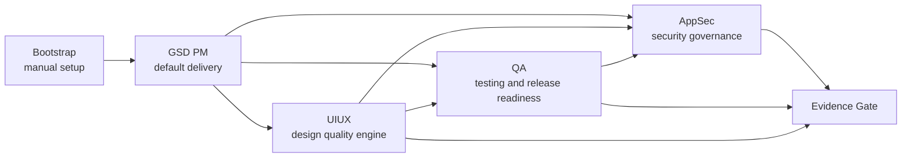

# Architecture Overview

这份文档展开 README 中的总览：五条 orchestrator 主线、四层控制面，以及跨主线 handoff。

## 1. 四层控制面



| 层 | 作用 | 不做什么 |
|---|---|---|
| L0 沟通层 | 把意图、业务目标、计划卡和人类确认放在最前面 | 不替代执行门禁 |
| L1 路由层 | 根据 intent 把任务送到最合适的主线 | 不让含糊任务直接进入高风险安全执行 |
| L2 执行强制层 | 用 hooks / SDK / guard 强制执行约束 | 不把 prompt 当强制机制 |
| L3 证据/门禁层 | 统一产物、裁决词和 gate.check | 不让动态 workflow 直接发布裁决 |

## 2. 五条主线



| 主线 | 版本 | 定位 | 关键思想 |
|---|---|---|---|
| Bootstrap | — | 安装环境和项目级 hook | 只提示，不自启；proposal 和 verify 都是人工坎 |
| GSD PM | — | 默认交付主线 | Tier 1-4，把讨论、计划、执行、review、verify、ship 串起来 |
| UIUX | `v2.3` | 产品体验和视觉质量 | grounding first，style lock 后再 build，统一和 review 都有门 |
| QA | `v3.2` | 测试与发布准备度 | 先风险分级，再决定测试层，不把安全测试伪装成 QA |
| AppSec | `v3.0` | 安全治理和证据裁决 | 安全发现进入 finding schema，裁决进入 gate.check |

## 3. 跨主线 handoff

| 来源 | 条件 | 去向 |
|---|---|---|
| GSD | ship 前需要质量证据 | QA + AppSec |
| GSD | 前端/UI 需求 | UIUX |
| UIUX | visual、a11y、perf 或 release readiness | QA |
| UIUX | 前端安全、auth、API、secret | AppSec |
| QA | 碰到 auth、secret、payment、API abuse | AppSec |
| AppSec | 主动 pentest 需求 | ROE gate + manual pentest path |

## 4. 统一裁决词

| Verdict | 语义 | 常见动作 |
|---|---|---|
| PASS | 满足发布或交付条件 | 继续 ship / handoff |
| WARN | 可继续，但需要记录风险 | 继续并记录 issue |
| FAIL | 不满足条件 | 修复后重跑 |
| BLOCKED | 违反硬门或缺少授权 | 停止，不得绕过 |
| CONDITIONAL_PASS | 条件通过 | 列明条件和到期时间 |
| STALE | 证据过期或 spec_hash 不匹配 | 重新收集证据或重新批准 |
| STRATEGY_READY | 只到策略阶段，不是执行通过 | 等待执行或签字 |

## 5. 总原则

这套架构可以让 agentic workflow 更强，但它的可信度不来自“模型更聪明”，而来自以下约束：

```text
明确路由 → 有边界的执行 → 可追踪证据 → 确定性裁决 → 人类批准关键风险
```
