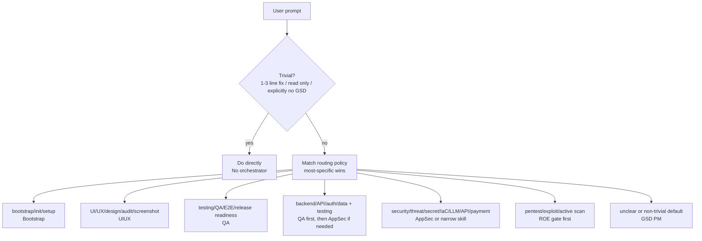
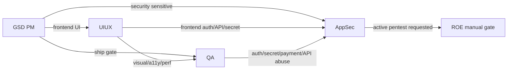

# Routing Policy

路由层解决的问题是：用户的一句话应该进入哪条主线、什么时候需要 handoff、什么时候必须先停下来要授权。

## 1. 决策流

## 2. 路由优先级

| 优先级 | 匹配 | 目标 | 原因 |
|---:|---|---|---|
| 0 | trivial / 明确要求不进 GSD | 直接处理 | 降低流程噪声 |
| 1 | pentest、exploit、active scan | ROE gate | 高风险动作必须先授权 |
| 2 | narrow security skill | AppSec 子技能 | 比大 orchestrator 更具体 |
| 3 | UI/UX/design/screenshot/audit | UIUX | 设计任务有独立 grounding/style lock 流程 |
| 4 | testing/QA/E2E/release readiness | QA | 测试任务先走风险分级 |
| 5 | bootstrap/init/setup | Bootstrap | 安装和配置必须手动确认 |
| 6 | 含糊或复杂交付 | GSD PM | 默认兜底，避免漏管 |

## 2.5 Tie-break 规则

实际策略文件（`skill-routing-policy.json`）有 24 个 `intent_category`，匹配时按下面的 tie-break 决断：

| 规则 | 含义 |
|---|---|
| `specificity` | 最具体的关键词赢（`pentest` > `security` > `testing`）；22 条 narrow security skill 排在大 orchestrator 之前 |
| `pentest_safety` | 任何 `pentest` / `active scan` / `exploit` 意图永远先过 `pentest-scope-and-roe`，不论其它匹配 |
| `appsec_vs_qa` | backend/API/auth/data + testing → 先 `enterprise-qa-testing`（再由 QA 转 AppSec），不直连 AppSec |
| `ambiguity_fallback` | 意图不清 → `gsd-pipeline-orchestrator` 兜底 |
| `trivial_skip` | 1-3 行 bugfix / 答疑 / "不用 GSD" → 跳过所有 orchestrator |

`pentest_active` 在数组里排最后，但 `pentest_safety` tie-break 保证它永远先过 ROE 门 —— 顺序与安全优先级是两件事。

## 3. Handoff 规则

## 4. 反模式

| 反模式 | 正确做法 |
|---|---|
| 所有复杂任务都直接交给一个万能 agent | 先路由，再由对应主线处理 |
| QA 自己跑安全攻击 | QA 只做测试治理；安全域转 AppSec |
| 模型看到 pentest 字样就开始扫 | 先 ROE，再授权，再校验 scope/time/window |
| 动态 workflow 临时生成 release verdict | dynamic 只能侦察；verdict 由 deterministic gate 产出 |
