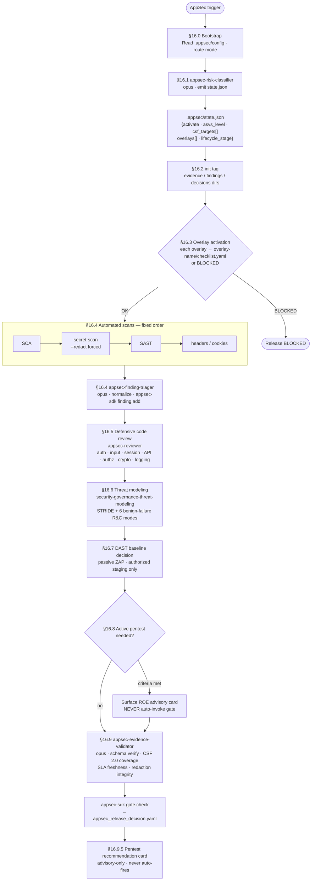
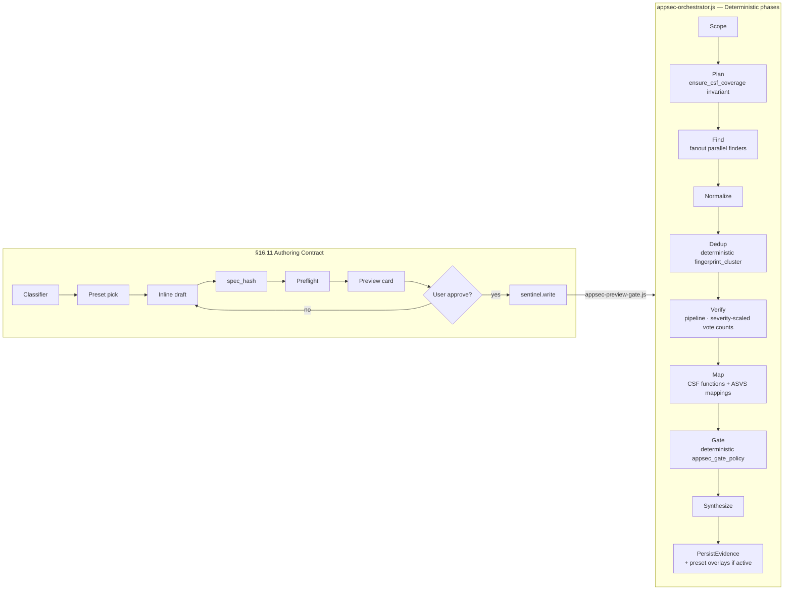
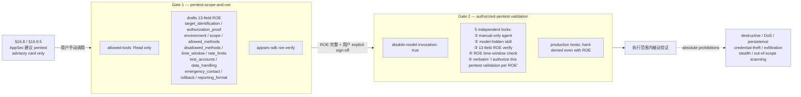

# AppSec Orchestrator — 应用安全主线深度解析

AppSec 主线（`appsec-security-orchestrator` v3.0）负责全栈安全治理：应用安全、平台安全、合规对齐、安全证据链与 release gate 决策。它对齐 **NIST CSF 2.0 六功能**（GV / ID / PR / DE / RS / RC），把 18 个 sub-skill 分层路由到 6 个能力层，支持 **prompt-only（默认）** 与 **workflow-spec（opt-in）** 双模式。**绝不执行 active scan** — 渗透测试路径严格由人类手动双 gate 控制。

---

## 1. 双模式对比

| 维度 | Prompt-only（默认） | Workflow-spec（opt-in） |
|---|---|---|
| 触发 | AppSec trigger 词 + `.appsec/config.json` | `execution_mode = "workflow-spec"` OR Workflow 工具可用 |
| 调用路径 | SKILL §16 9-step inline dispatch | §16.11 14-step authoring → `appsec-orchestrator.js` deterministic runner |
| 证据持久化 | `appsec-sdk evidence.append` / `gate.check` | 同左 + `spec_hash` + sentinel |
| 人类审批 | 结果呈现后用户判断 | preview gate → user approval → `sentinel.write` → 锁 `allow_dynamic_workflow=false` |
| 适用场景 | 日常 review、quick audit、探索 | release gate、commercial-cert、合规审查 |

---

## 2. Prompt-only 主线（§16 完整流程）



### 六类 benign-failure 韧性威胁（§16.6 强制覆盖）

STRIDE 六类之外，`security-governance-threat-modeling` 还必须分析：

| # | 模式 | 典型后果 |
|---|---|---|
| R1 | retry storms | 级联放大、后端过载 |
| R2 | concurrent invocation | 竞态条件、状态不一致 |
| R3 | unbounded resource | OOM / disk full / cost runaway |
| R4 | failure cascade | 服务雪崩 |
| R5 | cost runaway | LLM token / API 计费失控 |
| R6 | capacity ceiling | 触顶后的优雅降级缺失 |

---

## 3. Workflow-spec 流程（§16.11 + appsec-orchestrator.js）

14-step authoring contract 生成 spec → `spec_hash` → preview gate → 人类 approve → `sentinel.write` → deterministic runner：



**governed preset 铁律**：`allow_dynamic_workflow` 默认 `false`；release / commercial / payment / incident-response / pentest preset **必须** false，写入 `spec_hash`，preview gate 见 `true` 直接拒。

---

## 4. 六层能力 × CSF 2.0 映射

| 能力层 | CSF 功能 | Sub-skills |
|---|---|---|
| governance | GV | `security-governance-threat-modeling` |
| app | ID + PR | `security-app-api` · `security-app-file-upload` · `security-app-llm` · `security-app-mobile` · `security-app-multitenant` · `security-app-websocket` · `security-remediation` · `dast-baseline-scanning` |
| platform | PR | `security-platform-secrets` · `security-platform-iac-cloud` · `security-platform-supply-chain` |
| operations | DE | DAST baseline / logging / monitoring（dast-baseline-scanning 驱动） |
| response | RS + RC | `security-response-incident-response` · `security-response-recovery` · `security-response-red-purple-team` · `pentest-scope-and-roe` · `authorized-pentest-validation` |
| compliance | GV | `security-compliance-payment` · `security-compliance-cn-data` · `security-compliance-privacy` |
| visualization | （跨功能） | `security-viz`（render-only，从 `.appsec/` 事实源生成图表） |

---

## 5. 18 个 Sub-skills 速查

| Sub-skill | 层 | 核心标准 / 范围 |
|---|---|---|
| `security-governance-threat-modeling` | governance | STRIDE + 6 R&C benign-failure modes |
| `security-app-api` | app overlay | OWASP API Top 10:2023 · IDOR/BOLA/BFLA |
| `security-app-file-upload` | app overlay | MIME / path traversal / malware quarantine |
| `security-app-llm` | app overlay | OWASP LLM Top 10 + agentic ASI01-10 |
| `security-app-mobile` | app overlay | OWASP MASVS 2.x |
| `security-app-multitenant` | app overlay | tenant isolation · role matrix · data boundary |
| `security-app-websocket` | app overlay | origin validation · message integrity |
| `security-remediation` | app | min-viable fix + regression test per finding |
| `dast-baseline-scanning` | app / ops | passive ZAP only · zero attack payloads |
| `security-platform-secrets` | platform | secret lifecycle · rotation · vault patterns |
| `security-platform-iac-cloud` | platform | Terraform / K8s / cloud config · CIS |
| `security-platform-supply-chain` | platform | SCA / SBOM / SLSA provenance |
| `security-response-incident-response` | response | NIST 800-61r3 |
| `security-response-recovery` | response | CSF RC · BCP/DR · RTO/RPO |
| `security-response-red-purple-team` | response | planning-only · MITRE ATT&CK coverage · attack.coverage → security-viz |
| `pentest-scope-and-roe` | response | allowed-tools: Read only · 13-field ROE draft |
| `authorized-pentest-validation` | response | disable-model-invocation: true · 5 independent locks |
| `security-compliance-payment` | compliance | PCI DSS 4.0.1 |
| `security-compliance-cn-data` | compliance | PIPL |
| `security-compliance-privacy` | compliance | GDPR / CCPA / CPRA |
| `security-viz` | visualization | render-only · diagrams from `.appsec/` fact-sources |

---

## 6. 5 个专用 Agents

| Agent | Model | 职责 |
|---|---|---|
| `appsec-risk-classifier` | opus | 读项目信号 → emit `.appsec/state.json`；NEVER 读 `.env`/secrets |
| `appsec-finding-triager` | opus | normalize raw scan output → schema v1.0；`appsec-sdk redact` 强制先行；NEVER 输出 raw secret |
| `appsec-evidence-validator` | opus | 读 evidence/<tag>/；验证 §9 schema / CSF 2.0 六功能覆盖 / SLA 新鲜度 / redaction 完整性；PASS/FAIL/BLOCKED/CONDITIONAL_PASS；NEVER 静默降级 |
| `appsec-reviewer` | sonnet（L2+ 升 opus） | auth / input-validation / session / API / authz / crypto / logging 防御性 code review；不执行 active scan |
| `pentest-scope-planner` | sonnet | allowed-tools: Read only；起草 13-field ROE → 落盘走 agent，不自己 Write |

---

## 7. Finding Schema v1.0

所有 raw scan 输出必须经 `appsec-finding-triager` normalize 后才能影响 release decision。

```yaml
schema_version: "1.0"
id: APPSEC-2026-0001
source: secret-scan           # sast | sca | secret-scan | dast | code-review | iac
detector: gitleaks
severity: high                # critical | high | medium | low
confidence: medium            # high | medium | low
asvs_mapping:
  - "v5.0.0-14.3.1"          # ASVS 5.0 versioned identifiers; empty [] requires non-empty unmapped_reason
csf_function: PR              # GV | ID | PR | DE | RS | RC
description: "Potential credential token found in test fixture config"
cwe: "CWE-798"
owasp_top10: "A09:2025"
computed_risk: high           # derived: severity × confidence × exposure
sla_due: "2026-06-21"        # critical=24h high=7d medium=30d low=90d
status: open                  # open | in-remediation | resolved | accepted
verification_status: unverified
test_commands:
  - "pytest tests/security/test_credential_exposure.py"
redacted: true                # secret material redacted via appsec-sdk redact
risk_acceptance: null         # required for CONDITIONAL_PASS on critical findings
# risk_acceptance fields when populated:
#   approver, approval_date, review_date, compensating_controls
```

---

## 8. Gate 决策与证据层

### Gate verdicts

| Verdict | 含义 | 前提 |
|---|---|---|
| `PASS` | 全部通过 | 所有必需证据层 GREEN + 无 open critical |
| `FAIL` | 阻断发布 | 存在 unresolved critical/high |
| `BLOCKED` | 流程缺陷 | 必需证据层缺失 / overlay checklist 未完成 / STALE |
| `CONDITIONAL_PASS` | 条件通过 | 每条 critical 有完整 `risk_acceptance`（approver + approval_date + review_date + compensating_controls） |
| `STALE` | 证据过期 | evidence 时间戳 > 168h |

### 必需证据层（全部需要 → gate PASS）

```
threat-model · sca · secret-scan · sast · code-review · headers-cookies
+ overlay-<name>  (每个 activated overlay 各一层；缺任何一层 → BLOCKED)
```

### appsec-sdk 主要命令（~22 个）

```bash
appsec-sdk init                  # 初始化 + project-hooks 安装
appsec-sdk set-active <tag>
appsec-sdk finding.add           # 唯一 canonical 写入路径
appsec-sdk gate.check            # 0=PASS 1=FAIL 2=BLOCKED 3=CONDITIONAL_PASS
appsec-sdk redact                # 强制先于 finding.add 执行
appsec-sdk roe.verify            # 验证 13-field ROE 完整性
appsec-sdk csf.coverage          # 确认六功能覆盖
appsec-sdk overlay.activate
appsec-sdk asset.inventory
appsec-sdk data.classify
appsec-sdk authz.matrix
appsec-sdk attack.coverage       # red-purple-team → security-viz 消费
appsec-sdk pentest.recommend
appsec-sdk control.coverage
appsec-sdk audit.package
```

---

## 9. 渗透测试双 Gate（严格手动）

AppSec **绝不**自动触发 active testing。active 路径是两道独立手动 gate：



---

## 10. 10 个 Project Hooks

Hooks 通过 `appsec-sdk init` 注册到 `<project>/.claude/settings.json`，**user-global 不 fire**（fresh project 无 `.appsec/config.json` 时零 enforcement）。

| Hook | 类型 | 职责 |
|---|---|---|
| `appsec-secret-redaction` | Stop | 终态强制 redaction 检查；不可降级 |
| `appsec-active-scan-guard` | PreBash | 拦截 sqlmap/nmap-sV/nuclei/ffuf/hydra/msfconsole；prod hard-denied |
| `appsec-pentest-authorization` | PreSkill/Agent | gates `authorized-pentest-validation` 调用 |
| `appsec-evidence-required` | Stop | 验证必需证据层存在 |
| `appsec-finding-schema-prewrite` | PreWrite | 阻止直接写 findings；强制走 `finding.add` |
| `appsec-finding-schema-postverify` | PostWrite | 写后 schema 合规审计 |
| `appsec-secret-access-guard` | PreRead/Bash | 拦截 `.env`/`.pem`/`.key` 读取 + env dump |
| `appsec-preview-gate` | PreWorkflow | spec_hash sentinel 验证 |
| `governed-gate-workflow-guard` | PreWorkflow | 在 governed gate 期间拦截 inline Dynamic Workflow |
| `appsec-pentest-recommended` | Stop | advisory-only 渗透测试建议卡；不触发 gate |

---

## 11. 标准体系交叉索引

| 标准 | 版本 | 在本体系的角色 |
|---|---|---|
| OWASP ASVS | 5.0（V1-V17）；4.x V2-V13 deprecated | finding `asvs_mapping` 主键 |
| OWASP Top 10 | 2025 | `owasp_top10` 字段 |
| OWASP API Top 10 | 2023 | `security-app-api` overlay |
| OWASP LLM Top 10 + agentic | ASI01-10 | `security-app-llm` overlay |
| OWASP MASVS | 2.x | `security-app-mobile` overlay |
| OWASP WSTG | latest（passive） | dast-baseline-scanning |
| NIST CSF | 2.0（GV/ID/PR/DE/RS/RC） | `csf_function` 字段 + 六层能力 map |
| NIST SSDF | SP 800-218 | supply chain + platform |
| NIST SP | 800-30/40/53A/61r3/63B/86/92/154/190 | threat model / IR / recovery |
| CIS Controls | v8.1 | IaC/cloud baseline |
| MITRE ATT&CK | latest | red-purple-team → attack.coverage |
| PCI DSS | 4.0.1 | `security-compliance-payment` |
| PIPL | 现行 | `security-compliance-cn-data` |
| GDPR / CCPA / CPRA | 现行 | `security-compliance-privacy` |
| CWE | latest | `cwe` 字段 |
