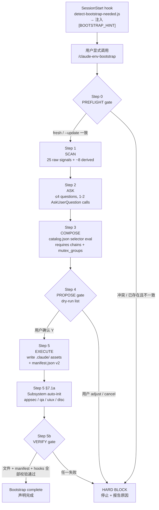

# claude-env-bootstrap — Environment Bootstrap Orchestrator

**主线**：Project Setup｜**模式**：manual-first，`disable-model-invocation: true`（永不自动运行）｜**执行方式**：SKILL-direct only

Bootstrap 的核心定位是**选择器引擎（selector engine）**，而不是预设包（preset bundle）。它扫描项目信号，通过 `catalog.json` 的声明式选择器动态组合定制安装计划，然后写入文件——每次安装的 skills/rules/agents 组合都是针对该项目信号量身定制的。

---

## 触发机制：SessionStart Hook

```
SessionStart
  └── detect-bootstrap-needed.js
        ├── 检测 cwd 是否缺少 .claude/
        ├── 有缺口 → 注入 [BOOTSTRAP_HINT] 到上下文
        │     └── 模型在第一轮用户消息前提示一次：
        │           "检测到还没 .claude/ 环境，要不要 /claude-env-bootstrap 装一下？"
        ├── 用户答 是 → 用户必须显式输入 /claude-env-bootstrap（model 不自动触发）
        └── 用户答 否/忽略 → 本 session 不再提示
```

**铁律**：`claude-env-bootstrap` 是 manual-first，hook 只负责"提示一次"，触发由用户显式 slash command 完成。绝不静默自启。

---

## 六步工作流



---

## 步骤详解

### Step 0 — PREFLIGHT（门禁）

碰撞检查（collision check）：

| 场景 | 行为 |
|---|---|
| `.claude/` 不存在 | 允许继续（fresh install） |
| `.claude/` 已存在 + 用户传入 `--update` | 允许继续（update 模式） |
| `.claude/` 已存在 + 无 `--update` | BLOCK，绝不静默覆盖 |
| `manifest.json` 存在但版本不一致 | BLOCK，要求用户确认 |

### Step 1 — SCAN（信号扫描）

使用 Glob / Read / Grep / Bash 提取：

**25 个 raw signals（部分）**

| 信号类别 | 具体信号 |
|---|---|
| 语言/框架 | `lang`, `framework` |
| 部署面 | `deploy_target`, `surface` |
| 风险面 | `risk_surface.auth`, `risk_surface.payment`, `risk_surface.file_upload`, `risk_surface.admin` |
| AI/LLM | `llm_provider`, `ai_pattern` |
| 合规信号 | `payment_signal`, `cn_data_signal`, `multitenant_signal`, `mobile_native_signal` |
| 环境 | `env_baseline_gaps` |

**~8 个 derived signals**

| Derived 信号 | 含义 |
|---|---|
| `_derived.is_saas` | 是否为 SaaS 产品 |
| `_derived.needs_release_gate` | 是否需要 release gate |
| `_derived.needs_compliance_payment` | 是否需要支付合规 |
| 以及其他衍生判断… | 由 raw signals 组合推导 |

### Step 2 — ASK（问卷，最多 4 问）

在 1-2 次 `AskUserQuestion` 调用内完成：

| 问题 | 类型 | 触发条件 |
|---|---|---|
| Q1：项目描述 | 必问 | 总是 |
| Q2：交付形态 | 必问 | 总是 |
| Q3：风格意图 | 条件 | 检测到 frontend/UI surface 时 |
| Q3：内容类型 | 条件 | 检测到文档/内容站时 |
| Q-pentest：渗透测试意图 | 条件 | 检测到高风险面时 |
| Q：ASO | 条件 | 检测到 mobile_native_signal 时 |
| Q：env parity | 条件 | 检测到 env_baseline_gaps 时 |

### Step 3 — COMPOSE（选择器组合）

读取 `catalog.json`，对每个 skill 的 selector 与 `signal_vector` 求值：

```
catalog.json
  ├── selector eval: signal_vector 满足条件 → 入选
  ├── requires 链: e.g. web-aeo 自动拉入 discoverability-orchestrator
  ├── mutex_groups: L3 风格互斥
  │     → taste-skill / luxury / brutalist-skill 只能装一个
  └── never:true skills: pentest gates 仅当 Q-pentest 手动答 "yes" 才安装
      (pentest-scope-and-roe, authorized-pentest-validation 是 safety-critical，
       改名 = 打掉 safety gate，禁止重命名)
```

### Step 4 — PROPOSE（门禁，dry-run 预览）

向用户展示完整 dry-run 清单：

```
将安装的 skills         — 列出每条 + selector 证据
将配置的 rules          — 列出路径
将复制的 agents         — 列出名称
将创建的 templates      — 列出路径
将写入的文件            — 完整列表
排除的 skills           — 列出 + 排除原因
```

用户选择：**Y（确认执行）** / **adjust（修改计划）** / **cancel（中止）**

在用户确认前，不写入任何文件。

### Step 5 — EXECUTE（写入）

按 `catalog.json` 的 `kind` 路由分发：

| kind | 写入位置 / 动作 |
|---|---|
| `reviewer` | 复制到 `.claude/agents/` |
| `plugin` | 打印 `claude plugin install <name>`（不自动执行安装） |
| 其他 skill | 复制到 `.claude/skills/` |
| rules | 复制到 `.claude/rules/` |
| templates | 复制到 `.claude/templates/` |

写入 `manifest.json` v2（含每个 skill 的 `selector_evidence`），从模板生成 `CLAUDE.md`。

**Step 5 §7.1a — 子系统 auto-init**

对每个入选的子系统，自动运行对应 SDK `init`（幂等，可重复运行）：

```bash
# AppSec 子系统
bash ~/.claude/scripts/appsec-sdk.sh init

# QA 子系统
bash ~/.claude/scripts/qa-sdk.sh init

# UIUX 子系统
bash ~/.claude/scripts/uiux-sdk.sh init

# Discoverability / L12 子系统
python ~/.claude/skills/discoverability-orchestrator/scripts/discoverability-sdk.py \
  --project-root . init
```

`init` 的规范定义：canonical idempotent hook-installer，读取 `manifests/hook-registry.json`，通过 `orchestrator-runtime/shared/install-subsystem-hooks.js` 将子系统 hooks 复制进 `<project>/.claude/hooks/` 并注册到 `<project>/.claude/settings.json`。

### Step 5b — VERIFY（门禁，硬校验）

全部通过才能宣布 "Bootstrap complete"，任一失败 = HARD BLOCK：

```
校验项 1: 所有计划写入的文件确实存在
校验项 2: manifest.json 是 v2 格式，含 selector_evidence
校验项 3: 每个入选子系统的 hooks 已注册在 <project>/.claude/settings.json
```

---

## ORACLE-001 原则

> **"Context loaded ≠ enforced."**
>
> `CLAUDE.md` / `rules/*.md` 是加载进上下文的软约束，模型可以读到但也可以被绕过。
> 只有注册在 `settings.json` 的 hooks（`PreToolUse` exit 2）才是硬约束——工具调用会被
> 操作系统级别拦截，模型无法绕过。
>
> Bootstrap VERIFY 硬门控在 hooks 被注册这一步，正是因为这个原则。

---

## 输出产物

| 产物 | 路径 | 用途 |
|---|---|---|
| Skills | `.claude/skills/` | 项目可用 skill 集合（按信号精选） |
| Rules | `.claude/rules/` | 软约束上下文（coding style / security / testing 等） |
| Agents | `.claude/agents/` | 项目 agent 定义（reviewer 类 kind） |
| Templates | `.claude/templates/` | 模板文件（CLAUDE.md 生成源等） |
| Manifest | `.claude/manifest.json` v2 | 安装状态、版本、每 skill 的 selector_evidence |
| Project guide | `CLAUDE.md` | 项目级 Claude 使用说明（从模板生成） |
| Hook entries | `<project>/.claude/settings.json` | **真正的硬约束入口**（子系统 hooks 注册处） |

---

## 全局 vs 项目级 Hooks

| Hook 层级 | 数量 | 触发条件 | 典型成员 |
|---|---|---|---|
| 全局（user-global） | 11 个 | 每个 session 都 fire | `detect-bootstrap-needed.js` + 10 个 GSD hooks |
| 项目级（project-installed） | 按子系统 | 仅当该子系统 config 文件存在时 | AppSec / QA / UIUX / L12 各自的 hooks |

Fresh project 无对应 config 文件时，子系统 hooks 0 enforcement——只有全局 GSD hooks fire。

---

## 设计边界（三条铁律）

```
Bootstrap 可以提示，但不能自启。          ← detect-bootstrap-needed.js 只注入 hint
Bootstrap 可以建议，但不能跳过 proposal。  ← Step 4 是硬门禁，无 bypass
Bootstrap 可以写文件，但必须 verify。      ← Step 5b 失败 = HARD BLOCK，不得宣布完成
```
