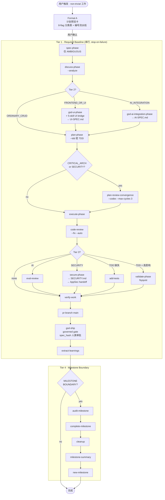

# GSD Pipeline Orchestrator — PM 交付主线

`gsd-pipeline-orchestrator` 是所有非平凡工作的默认入口。它是一个 **META-orchestrator**：
自身不写代码、不出设计稿，只负责将需求分类、组合出精确的 `gsd-*` 命令序列，并串行派发直至失败中止。
它的执行模式是 **SKILL-direct only**（非 workflow-spec），可原生嵌入多周期检查点与人在环交互。

---

## 1. 跳过条件（何时绕过 GSD）

以下场景不触发，直接执行：

- 1–3 行 bugfix / 单行配置改动
- 纯读代码 / 解释逻辑 / 回答问题
- 用户明确说"不用 GSD"
- 单文件工具函数、无行为变更

---

## 2. 分类旗标（8 个布尔 Flag）

进入 GSD 后首先评估以下 8 个 flag；它们决定 Tier 2 / Tier 3 是否插入对应阶段：

| Flag | 含义 | 主要影响 |
|---|---|---|
| `AMBIGUOUS_REQUIREMENTS` | 需求不清晰、存在歧义 | 强制先过 `spec-phase` |
| `FRONTEND_OR_UI` | 涉及任何前端 / 用户界面工作 | 插入 `gsd-ui-phase` + 5-skill UI bridge（Tier 2）|
| `AI_INTEGRATION` | 引入 LLM / Agent / AI 管道 | 插入 `gsd-ai-integration-phase`（Tier 2）+ `eval-review`（Tier 3）|
| `CRITICAL_ARCHITECTURE_OR_NEW_FRAMEWORK` | 关键架构路径或引入新框架 | 触发 `plan-review-convergence --codex --max-cycles 3` |
| `SECURITY_SENSITIVE` | 认证 / 授权 / 支付 / 用户数据等安全敏感面 | 触发 `plan-review-convergence` + `secure-phase`（Tier 3）|
| `CORE_LOGIC_TDD_RECOMMENDED` | 核心业务逻辑，建议测试先行 | `plan-phase --tdd`；若未完成则 Tier 3 补 `add-tests` + `validate-phase` |
| `ORDINARY_CRUD` | 普通 CRUD，无特殊复杂度 | 降低流程重量，Tier 2 / 3 均不插入 |
| `MILESTONE_BOUNDARY` | 里程碑边界 | 追加完整 Tier 4 收尾序列 |

---

## 3. Tier 1–4 全流水线

### Tier 总览

| Tier | 名称 | 触发条件 | 代表命令 |
|---|---|---|---|
| **1** | Required Baseline | 所有非平凡任务（必跑）| `discuss-phase` → `plan-phase` → `execute-phase` → `code-review` → `verify-work` → `pr-branch` → `gsd-ship` |
| **2** | Pre-Plan Inserts | `FRONTEND_OR_UI` 或 `AI_INTEGRATION` | `gsd-ui-phase` / `gsd-ai-integration-phase` |
| **3** | Pre-Verify Quality Gates | AI / Security / TDD 缺失 / 高影响 | `eval-review` / `secure-phase` / `add-tests` / `validate-phase` |
| **4** | Milestone Boundary | `MILESTONE_BOUNDARY = true` | `audit-milestone` → `complete-milestone` → `cleanup` → `milestone-summary` → `new-milestone` |

### Tier 1 串行基线（任一步失败即中止）

```
spec-phase          (仅 AMBIGUOUS_REQUIREMENTS)
    ↓
discuss-phase --analyze
    ↓
[Tier 2 在此插入]
    ↓
plan-phase [--tdd 若 CORE_LOGIC_TDD]
    ↓
plan-review-convergence --codex --max-cycles 3   (仅 CRITICAL_ARCH 或 SECURITY)
    ↓
execute-phase
    ↓
code-review --fix --auto
    ↓
[Tier 3 在此插入]
    ↓
verify-work
    ↓
pr-branch main
    ↓
gsd-ship             (governed release gate: deterministic spec-runner + spec_hash 人类审批)
    ↓
extract-learnings
    ↓
[Tier 4 在此插入（仅 MILESTONE）]
```

### Tier 2 — Pre-Plan Inserts（discuss 与 plan 之间）

| Flag | 插入阶段 | 说明 |
|---|---|---|
| `FRONTEND_OR_UI` | `gsd-ui-phase` + 5-skill UI bridge | 产出 `UI-SPEC.md`；`plan-phase` 不得在视觉底盘锁定前启动 |
| `AI_INTEGRATION` | `gsd-ai-integration-phase` | 框架选型 + AI-SPEC.md + eval 策略 |
| `ORDINARY_CRUD` only | 无插入 | 直接进 `plan-phase` |

### Tier 3 — Pre-Verify Quality Gates（code-review 与 verify-work 之间，顺序执行）

| 条件 | 插入命令 | 说明 |
|---|---|---|
| `AI_INTEGRATION` | `eval-review` | 审计 AI 评估覆盖度，产出 `EVAL-REVIEW.md` |
| `SECURITY_SENSITIVE` | `secure-phase` → `security-auditor` | 产出 `SECURITY.md`；handoff `appsec-security-orchestrator` |
| TDD 应做但未完成 | `add-tests` | 补测试覆盖 |
| TDD 完成 + 高影响 | `validate-phase`（Nyquist）| Nyquist 验证：每个需求至少一个可执行测试 |

### Tier 4 — Milestone Boundary（仅 `MILESTONE_BOUNDARY`）

```
audit-milestone → complete-milestone → cleanup → milestone-summary → new-milestone
```

---

## 4. 完整流程图



---

## 5. Agent 团队编排模式

GSD 内置多种 agent 协作模式，由 orchestrator 按场景自动选择：

| 模式 | 触发场景 | 参与 Agent / 工具 | 说明 |
|---|---|---|---|
| **Single-agent review** | 常规 code review | `code-reviewer` (sonnet) | 轻量，单路径 |
| **Parallel fan-out review** | 高风险改动 | `code-reviewer` + `security-reviewer` + `typescript-reviewer`（均 opus）| 并行，独立视角 |
| **Plan-review convergence** | `CRITICAL_ARCH` / `SECURITY` | Codex × 3 轮 (`/codex:adversarial-review`) | 收敛确认后再 execute |
| **Santa-loop dual-blind** | 最终质量门 | 两个独立 reviewer，双盲双签 | 两者都 PASS 才放行 |
| **GAN team** | AI 生成 / 前端快速铺 | `gan-planner` → `gan-generator` ⟳ `gan-evaluator` | Generator 迭代直至 Evaluator 通过 |
| **Codex delegation** | 明确编码任务外包 | `codex@openai-codex`: `/codex:rescue` / `/codex:review` | 额度耗尽自动 fallback 到 Claude subagent |
| **Multi-cycle debug** | 复杂 bug 调查 | `gsd-debug-session-manager` ⟳ `gsd-debugger` + `AskUserQuestion` | 支持多轮检查点与人工介入 |

---

## 6. 模型路由

| 层级 | Model | 典型 Agent / 命令 |
|---|---|---|
| 决策层 | `opus` | `planner` / `architect` / `security-reviewer` / santa-loop 最终裁决 / GAN evaluator / `execute-phase` |
| 执行层 | `sonnet` | `code-reviewer` / `tdd-guide` / `build-error-resolver` / GAN generator / 大多数日常 agent |
| 工具层 | `haiku` | `doc-updater` / 格式转换 / 批量字段抽取 |

---

## 7. 计划预览卡（Plan-Preview Card）

GSD 是 §0.6 Universal Plan-Preview Card 的具体实现，提供三种 Format：

| Format | 时机 | 内容 |
|---|---|---|
| **A · 分类卡** | 执行前 | 8-flag 分类表 + 编号流水线 + 每步 agent/team/model 标注 + 预期产物 + "确认执行？yes / modify / cancel" |
| **B · 运行卡** | 用户确认后 | 打印 Format A → 等待 → 逐命令派发 → 失败时中止并汇报 |
| **C · 续跑卡** | 中断后 Resume | 读 `.planning/STATE.md` → 定位 next step → 精简续跑卡 |

---

## 8. Skill 与 Agent 清单

### ~68 个 gsd-* Skill（分组）

| 组 | 代表 Skill |
|---|---|
| project-setup | `gsd-new-project` / `gsd-new-milestone` / `gsd-import` |
| spec-discuss | `gsd-spec-phase` / `gsd-discuss-phase` / `gsd-capture` |
| planning | `gsd-plan-phase` / `gsd-ultraplan-phase` / `gsd-spike` |
| execution | `gsd-execute-phase` / `gsd-fast` / `gsd-quick` |
| code-review-quality | `gsd-code-review` / `gsd-add-tests` / `gsd-refactor-clean` |
| security | `gsd-secure-phase` / `gsd-audit-fix` |
| ai-eval | `gsd-ai-integration-phase` / `gsd-eval-review` |
| verify-ship | `gsd-verify-work` / `gsd-validate-phase` / `gsd-ship` / `gsd-pr-branch` |
| debug | `gsd-debug` |
| docs-codemaps | `gsd-docs-update` / `gsd-map-codebase` / `gsd-graphify` |
| milestone | `gsd-audit-milestone` / `gsd-complete-milestone` / `gsd-cleanup` / `gsd-milestone-summary` |
| state-resume-pause | `gsd-resume-work` / `gsd-pause-work` / `gsd-progress` |
| utility-meta | `gsd-health` / `gsd-stats` / `gsd-settings` / `gsd-intel-updater` |
| namespace `gsd-ns-*` | `gsd-ns-context` / `gsd-ns-ideate` / `gsd-ns-manage` / `gsd-ns-project` / `gsd-ns-review` / `gsd-ns-workflow` |
| user-profiling | `gsd-profile-user` |

### 33 个 gsd-* Agent（分组）

| 组 | Agent |
|---|---|
| researchers ×6 | `gsd-phase-researcher` / `gsd-project-researcher` / `gsd-ai-researcher` / `gsd-domain-researcher` / `gsd-advisor-researcher` / `gsd-assumptions-analyzer` |
| planners ×4 | `gsd-planner` / `gsd-roadmapper` / `gsd-framework-selector` / `gsd-pattern-mapper` |
| executors ×2 | `gsd-executor` / `gsd-code-fixer` |
| reviewers ×3 | `gsd-code-reviewer` / `gsd-ui-auditor` / `gsd-ui-checker` |
| verifiers ×5 | `gsd-verifier` / `gsd-plan-checker` / `gsd-integration-checker` / `gsd-nyquist-auditor` / `gsd-eval-auditor` |
| auditors / security ×2 | `gsd-security-auditor` / `gsd-eval-planner` |
| debug ×2 | `gsd-debug-session-manager` / `gsd-debugger` |
| docs ×5 | `gsd-doc-writer` / `gsd-doc-classifier` / `gsd-doc-synthesizer` / `gsd-doc-verifier` / `gsd-codebase-mapper` |
| ui ×3 | `gsd-ui-researcher` / `gsd-ui-checker` / `gsd-ui-auditor` |
| utility ×3 | `gsd-research-synthesizer` / `gsd-intel-updater` / `gsd-user-profiler` |

---

## 9. 下游 Handoff 边界

| 下游主线 | 触发点 | 产物 / 前提 |
|---|---|---|
| **UIUX** (`uiux-product-orchestrator`) | `FRONTEND_OR_UI` → `gsd-ui-phase` | `UI-SPEC.md` 锁定后 `plan-phase` 才可启动 |
| **AppSec** (`appsec-security-orchestrator`) | `SECURITY_SENSITIVE` → `secure-phase` → `gsd-security-auditor` | `SECURITY.md` 是 `gsd-ship` 的前提条件之一 |
| **QA** (`enterprise-qa-testing`) | `add-tests` / `validate-phase` | QA evidence bundle 可被 `gsd-ship` 引用 |

---

## 10. 为什么是 SKILL-only，不迁 workflow-spec

GSD 保持 SKILL-direct 单模式，原因：

1. **多周期 checkpoint**：`gsd-debug-session-manager` 等需要跨轮次状态与人工介入，单 pass DAG 会丢失语义
2. **人在环 BLOCK/FLAG**：`gsd-ui-checker` / `gsd-plan-checker` 可能返回 BLOCK，需暂停等人类决策后再继续
3. **动态 Tier 插入**：Tier 2 / 3 的插入与否取决于运行时 flag，静态 DAG 无法优雅表达条件分支 + 中途 handoff
4. **`gsd-ship` governed gate**：已通过 deterministic spec-runner + `spec_hash` 人类审批实现治理，无需再套 workflow-spec 机制
