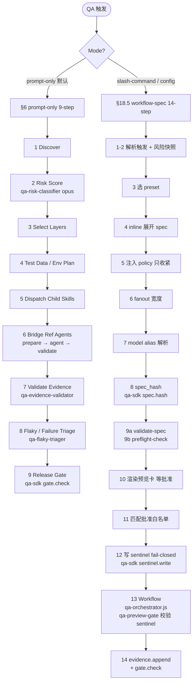
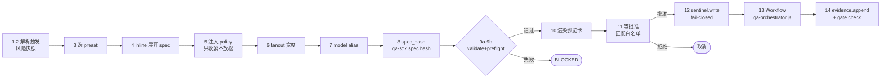

# Enterprise QA Testing Orchestrator（企业 QA 测试编排器）v3.2.0

QA 主线负责测试策略、风险分级、测试层选择、子 skill 派发、证据聚合和 release readiness 裁决。它**不是**简单的测试生成器，也**不是**安全攻击执行器——触碰 auth / secret / payment / 跨租户安全域时强制 handoff 给 `appsec-security-orchestrator`，active pentest 永远不自动触发。

---

## 1. 双模式总览

| 模式 | 触发方式 | 特点 |
|---|---|---|
| **prompt-only**（默认）| 自然语言 QA 请求 | §6 9-step inline 派发，调用 `qa-sdk evidence.append / gate.check` 持久化 |
| **workflow-spec**（显式）| `/qa-quick-check` `/qa-focused-gate` `/qa-release-readiness` `/qa-commercial-cert` 任一，或 `.qa/config.json` 设 `execution_mode = "workflow-spec"` | §18.5 14-step 确定性 workflow，含 `spec_hash` 人类审批 + sentinel + `qa-orchestrator.js` |



---

## 2. Prompt-only §6 九步详解

| Step | 名称 | 执行者 / 工具 | 关键输出 |
|---:|---|---|---|
| 1 | **Discover** | 主线程扫 package.json / manifests / git diff | 改动 surface 清单 |
| 2 | **Risk Score** | `qa-risk-classifier`（opus） | RiskScore + Floor 结论 |
| 3 | **Select Required Layers** | 主线程按风险 → 层映射表 | 选中测试层集合 |
| 4 | **Build Test Data / Env Plan** | 主线程 | 角色矩阵、租户、mock 策略 |
| 5 | **Dispatch QA Child Skills** | 每层对应 skill（见第 5 节）| 各层独立运行 |
| 6 | **Bridge Ref Agents** | 3-stage bridge：prepare_input → agent → validate_evidence | tdd-guide / e2e-runner / code-reviewer 产物 |
| 7 | **Validate Evidence** | `qa-evidence-validator`（sonnet）| PASS / FAIL / BLOCKED per layer |
| 8 | **Flaky / Failure Triage** | `qa-flaky-triager`（sonnet） | 8 类分类 + 8 字段隔离记录 |
| 9 | **Release Readiness Decision** | `qa-sdk gate.check` | 最终 verdict + exit code 0/1/2 |

> **preflight 强制要求**：3 个编排 agent（`qa-risk-classifier` / `qa-evidence-validator` / `qa-flaky-triager`）全部就位，任一缺失 → 整体 BLOCKED。

---

## 3. Workflow-spec §18.5 十四步



**commercial-cert 额外要求**：sentinel 必须含 `approved_estimate_high`（数字）+ approval text 含"approved / approve / 批准 / 确认 / 同意"之一，否则 `qa-preview-gate` 拒绝启动。

---

## 4. 四个 Slash-command Presets

| Preset | 定位 | 阶段数 | 估时 | Token 估算 | 能否作为 sign-off |
|---|---|---:|---|---|---|
| `/qa-quick-check` | dev 预提交自检 | ~5 | 5-10 min | 200-400 k | 否（非签发） |
| `/qa-focused-gate` | PR 门控，按改动 surface fanout | ~6 | 15-30 min | 500-800 k | 是（PR gate） |
| `/qa-release-readiness` | 合 main / release 前完整 bundle + flaky triage | ~9 | 30-60 min | 0.8-1.5 M | 是（release） |
| `/qa-commercial-cert` | 客户可见 / 受监管，加 Visual+A11y+Perf Audit→Gate | ~15 | 60-120 min | 1.5-3 M | 是（强制预算批准） |

---

## 5. 风险模型

```
RiskScore = Impact (1-5) × Likelihood (1-5) + ExposureModifier
```

**Exposure Modifier（加法，上限 +10）**：

| 条件 | 加分 |
|---|---:|
| 公开未认证接口（public-unauth） | +3 |
| 生产写路径（prod-write） | +3 |
| 多租户 RBAC 边界（multitenant-RBAC） | +3 |
| 第三方集成（third-party） | +3 |
| 支付 / auth / PII / secrets | +5 |
| Release-blocking 核心流程 | +5 |

**Floor 规则（计算后强制覆盖，必须输出即使未触发）**：

| 条件 | 最低风险等级 |
|---|---|
| Impact ≥ 5 | High |
| Impact ≥ 5 且任意 +5 modifier | Critical |
| 任何生产数据写路径 | Medium |
| 任何公开未认证入口 | Medium |

**风险等级 → 测试层映射**：

| 等级 | 分值 | 必选层 |
|---|---|---|
| Low | 1-5 | Static |
| Medium | 6-11 | +Unit/Component，如有跨边界调用 +Integration |
| High | 12-19 | +E2E，+A11y / Perf / Visual |
| Critical | 20+ | +negative-path，+角色 / 权限矩阵，+数据隔离，+evidence bundle，+AppSec handoff |

---

## 6. 九个测试层

| 层 # | 名称 | 负责 Skill | 工具 / 标准 |
|---:|---|---|---|
| 1 | Static Baseline | `qa-static-baseline` | tsc + ESLint + Prettier + npm audit + git-secrets |
| 2 | Unit / TDD | `qa-test-design-tdd-bridge` → `tdd-guide` | Vitest（3-stage bridge） |
| 3 | Component | `qa-component-behavior` | RTL + jsdom |
| 4 | Integration | `qa-integration-service-virtualization` | MSW / Testcontainers / Compose |
| 5 | Contract / API | `qa-contract-api` | OpenAPI / Pact / AsyncAPI / GraphQL schema diff |
| 6 | E2E | `qa-e2e-coverage-gate` → `e2e-runner` | Playwright（3-stage bridge） |
| 7 | Visual Regression | `qa-visual-regression` | Screenshot diff / Chromatic |
| 8 | Accessibility | `qa-a11y-compliance` | axe-core / WCAG 2.2 AA |
| 9 | Performance / Reliability | `qa-performance-reliability` | Lighthouse CI / k6 / Core Web Vitals |

**跨切面 skill（不属于单层）**：

| Skill | 职责 |
|---|---|
| `qa-smoke-release-safety` | 发布前冒烟 |
| `qa-test-data-environment` | 测试数据 + 环境治理 |
| `qa-flaky-governance` | 8 类分类 + 8 字段隔离记录；critical path 禁止隔离 |
| `qa-evidence-bundle` | 聚合 → `qa_evidence_bundle.yaml` + release_decision |

---

## 7. Agent 矩阵

### 编排 Agent（缺一 → BLOCKED）

| Agent | 模型 | 职责 |
|---|---|---|
| `qa-risk-classifier` | opus | Impact × Likelihood + Floor 计算，输出 Final Level + Evidence Confidence |
| `qa-evidence-validator` | sonnet | 读 `.qa/evidence/<tag>/` 验证 schema、SLA freshness、acceptance criteria |
| `qa-flaky-triager` | sonnet | 分类 retry-pass / CI-only-fail / nondeterministic，产出隔离记录 |

### 专属 Runner Agent（各自 emit `*_SCHEMA.v1`）

| Agent | 对应层 | 落地状态 |
|---|---|---|
| `qa-static-baseline-runner` | Layer 1 | runtime-proven |
| `qa-component-runner` | Layer 3 | wiring-audited |
| `qa-contract-runner` | Layer 5 | **reserved / unwired**（保留，未接线） |
| `qa-visual-runner` | Layer 7 | wiring-audited |
| `qa-a11y-runner` | Layer 8 | wiring-audited |
| `qa-perf-runner` | Layer 9 | wiring-audited |

> 诚实说明：9 个 runner agent 中，2 个 runtime-proven，6 个 wiring-audited，`qa-contract-runner` reserved/unwired。

### 复用 Reference Agent（通过 3-stage bridge 调用）

`tdd-guide`（Layer 2）/ `e2e-runner`（Layer 6）/ `code-reviewer`（cross-layer review）/ 各语言 reviewer（python-reviewer 等）

---

## 8. qa-sdk 命令（~12 条）

| 命令 | 作用 |
|---|---|
| `init` | 注册项目级 hooks 到 `.claude/settings.json` |
| `set-active` | 设置当前活跃 release tag |
| `evidence.append` | 追加证据条目 |
| `evidence.list` | 列出当前 tag 证据 |
| `evidence.validate-presence` | 检查必选层证据是否存在 |
| `gate.check` | 产出 verdict，exit code 0 PASS / 1 FAIL / 2 BLOCKED |
| `finding.add` | 登记 finding |
| `quarantine.add` | 登记 flaky 隔离（需 8 字段齐全） |
| `approve.snapshot` | 快照批准（必须 `--human-attested`） |
| `spec.hash` | 计算并锁定 spec_hash |
| `sentinel.write` | 写 sentinel（fail-closed，commercial-cert 须含 budget 批准） |
| `sentinel.show` | 查看当前 sentinel 状态 |

---

## 9. Verdict 体系

| Verdict | 语义 |
|---|---|
| `PASS` | 全部 required layer 通过 |
| `FAIL` | 至少一层 FAIL，且无风险接受记录 |
| `BLOCKED` | preflight 缺 agent / 编排错误 / `dispatch-failures.log` 非空 |
| `CONDITIONAL_PASS` | 存在 FAIL 但有签名的 `.qa/risk-acceptance.yaml`（需 6 字段） |
| `STRATEGY_READY` | 纯设计模式，未执行测试 |
| `WARN` | 非阻断性问题 |
| `STALE` | 证据超 168 小时未刷新 |

> **`dispatch-failures.log` 非空 → 强制 BLOCKED**，不可绕过。

---

## 10. 质量标准与性能预算

### WCAG 2.2 AA（Layer 8 硬性要求）

### Core Web Vitals 预算（按路由类型）

| 路由类 | LCP | INP | CLS | TBT |
|---|---|---|---|---|
| Marketing | < 2.0 s | < 150 ms | < 0.1 | — |
| Dashboard | < 2.5 s | < 200 ms | < 0.1 | — |
| Admin | < 3.5 s | < 300 ms | < 0.1 | — |
| 未分类 | 取更严阈值 | 取更严阈值 | — | — |

### ISO/IEC 25010:2023

9 个质量特征均通过层映射覆盖（功能适配性 / 性能效率 / 兼容性 / 可用性 / 可靠性 / 安全性 / 可维护性 / 可移植性 / 交互能力）。全局覆盖率无硬性百分比要求——由风险模型动态选层决定。

---

## 11. 项目级 Hooks（`qa-sdk init` 安装）

| Hook | 触发时机 | 作用 |
|---|---|---|
| `qa-block-update-snapshots` | PreToolUse | 阻止无 `--human-attested` 的快照更新 |
| `qa-floor-rule-prompt` | PreToolUse | 提醒 Floor Rule 必须输出 |
| `qa-detect-internal-mock` | PreToolUse | 检测测试内部 mock 污染 |
| `qa-quarantine-accountability` | PostToolUse | 强制 flaky 隔离记录 8 字段 |
| `qa-evidence-required` | Stop | 会话结束前检查证据是否落盘 |
| `qa-preview-gate` | PreToolUse[Workflow] | 验证 sentinel + spec_hash（workflow-spec 专属） |
| `qa-bundle-write-guard` | PostToolUse | 防 evidence bundle 被覆盖（workflow-spec 专属） |
| `qa-mark-stale` | PostToolUse | 超龄证据自动标 STALE（workflow-spec 专属） |

---

## 12. 安全边界（与 AppSec 的分工）

QA 永远**不实施**安全验证。以下场景触发强制 handoff：

- auth / secret scan / payment 逻辑验证
- API 滥用 / 速率限制测试
- 跨租户数据隔离渗透
- 任何 active pentest（永远 manual + ROE，不自动）

handoff 目标：`appsec-security-orchestrator`（`security-compliance-payment` / `security-app-multitenant` / `security-platform-secrets` 等 sub-skill）。
