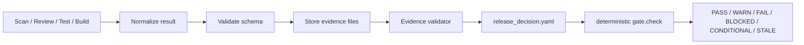
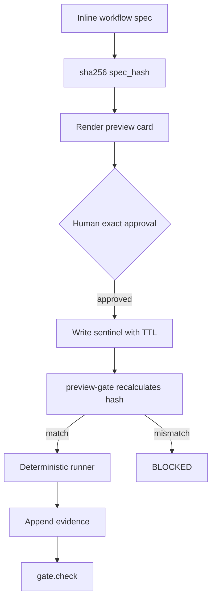

# Governance and Evidence

这套架构的核心可信度来自证据链和门禁，而不是来自单次模型判断。

## 1. Evidence flow



## 2. Evidence 文件建议

| 文件 | 用途 |
|---|---|
| `evidence/<tag>/findings/*.yaml` | 单条安全或质量发现 |
| `evidence/<tag>/qa_evidence_bundle.yaml` | QA 证据聚合 |
| `evidence/<tag>/appsec_release_decision.yaml` | AppSec 发布裁决 |
| `evidence/<tag>/uiux_release_decision.yaml` | UIUX 发布裁决 |
| `evidence/<tag>/gate_result.yaml` | gate.check 结果 |

## 3. Release decision schema

```yaml
schema_version: "1.0"
tag: release-2026-06-14
system: appsec
verdict: CONDITIONAL_PASS
summary: "No blocking findings. Two medium risks accepted until follow-up deadline."
spec_hash: sha256:example
inputs:
  - evidence/appsec/findings/APPSEC-2026-0001.yaml
  - evidence/appsec/findings/APPSEC-2026-0002.yaml
gates:
  required_evidence_present: true
  stale_evidence: false
  blocking_findings: 0
conditions:
  - id: COND-001
    owner: security
    due: 2026-06-30
    text: "Rotate test fixture token and add regression rule."
```

## 4. Governed workflow approval



## 5. Dynamic workflow boundary

Dynamic workflow is allowed as reconnaissance only.

| 能做 | 不能做 |
|---|---|
| 生成候选发现 | 产出 release verdict |
| 汇总风险草案 | 绕过 spec_hash |
| 建议测试层 | 绕过人工批准 |
| 帮助 triage | 修改 gate policy |

Final verdict 必须由 deterministic runner + evidence bundle + gate.check 产出。

## 6. Exit code 建议

| Verdict | Exit code | 含义 |
|---|---:|---|
| PASS | 0 | 放行 |
| WARN | 0 | 放行但记录 |
| CONDITIONAL_PASS | 3 | 条件放行 |
| FAIL | 1 | 失败，需修复 |
| BLOCKED | 2 | 硬阻断 |
| STALE | 2 | 证据或批准过期 |
| STRATEGY_READY | 0 | 只代表策略完成，不代表执行通过 |
