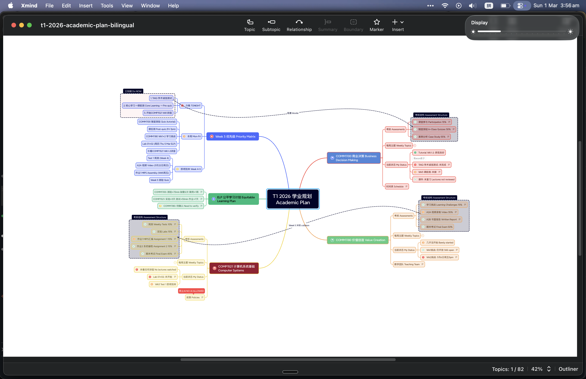
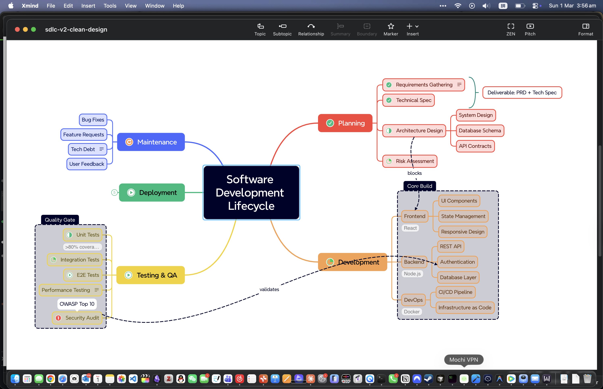

<p align="center">
  
</p>

<h1 align="center">XMind Ultimate MCP Server</h1>

<p align="center">
  <strong>最全功能的 XMind MCP Server，为 Claude Code 打造</strong><br>
  <strong>The most comprehensive XMind MCP Server for Claude Code</strong>
</p>

<p align="center">
  
  
  
  
  
</p>

---

## Demo 效果展示

**学业规划 Academic Plan (中英对照 Bilingual)**

<p align="center">
  
</p>

**软件开发生命周期 SDLC (Clean Design)**

<p align="center">
  
</p>

> 以上导图由 Claude Code + 本 MCP Server 一条命令自动生成，遵循 Skill 中的视觉设计原则。
>
> Both maps generated by Claude Code + this MCP Server in a single command, following visual design principles from the included Skill.

---

## 功能 Features

8 个 MCP 工具，覆盖 XMind 全部功能：

| # | 工具 Tool | 功能 Description | 状态 Status |
|---|-----------|-----------------|-------------|
| 1 | `create_mind_map` | 全功能创建：主题/边界/关系线/摘要/标注/浮动主题/标记/样式/主题/折叠 | ✅ 完整 |
| 2 | `create_from_text` | 缩进文本 / Markdown → .xmind | ✅ |
| 3 | `read_xmind` | 读取 .xmind 为结构化 JSON / 文本 | ✅ |
| 4 | `analyze_xmind` | 结构分析 + 优化建议 | ✅ |
| 5 | `convert_to_xmind` | JSON / CSV / YAML / Markdown → .xmind | ✅ |
| 6 | `translate_xmind` | 翻译节点标题（通过映射表） | ✅ |
| 7 | `export_xmind` | .xmind → Markdown / JSON | ✅ |
| 8 | `list_xmind_files` | 目录扫描 .xmind 文件 | ✅ |

### XMind 功能覆盖 Feature Coverage

| 功能 Feature | 说明 Description |
|--------------|-----------------|
| 层级主题 Hierarchical Topics | 无限嵌套子主题 Unlimited nesting |
| 10 种结构 Structures | 思维导图/逻辑图/组织架构/树状图/鱼骨图/时间线/矩阵 |
| 边界 Boundaries | 可视化分组框，9 种形状 Visual grouping with 9 shapes |
| 关系线 Relationships | 任意两主题间的连线 Cross-topic connections |
| 摘要 Summaries | 括号汇总同级主题 Bracket summarization |
| 标注 Callouts | 补充说明气泡 Annotation bubbles |
| 标记 Markers | 优先级/任务/旗帜/星标/表情/箭头/月份/星期 (60+) |
| 标签 Labels | 分类标签 Categorization tags |
| 笔记 Notes | 富文本注释 Rich text annotations |
| 浮动主题 Floating Topics | 独立于层级的主题 Independent positioned topics |
| 样式 Styles | 颜色/字体/形状/线条/边框 Full styling |
| 主题预设 Themes | default / professional / colorful / dark |
| 折叠 Folding | 预折叠分支 Pre-collapse branches |
| 多画布 Multi-sheet | 一个文件多张导图 Multiple canvases |

---

## 快速开始 Quick Start

### 1. 安装 Install

```bash
git clone https://github.com/Genius-Cai/xmind-ultimate-mcp.git
cd xmind-ultimate-mcp
npm install
npm run build
```

### 2. 注册 MCP Register MCP

```bash
claude mcp add --scope user xmind-ultimate node $(pwd)/dist/index.js
```

### 3. 安装 Skill (可选但推荐 Optional but Recommended)

```bash
cp skill/xmind.md ~/.claude/skills/xmind.md
```

Skill 提供 XMind 官方最佳实践指导，包括：
- 16 个官方功能模块详解 16 feature modules from official docs
- 场景→结构自动匹配 Scenario → Structure auto-matching
- 视觉设计原则 Visual Design Principles (基于 XMind 官方博客 + 设计理论)
- 反模式清单 Anti-patterns checklist
- 节点组织规则 Node organization rules (7±2 rule)

### 4. 使用 Usage

在 Claude Code 中直接说：

```
"帮我做一个项目管理的思维导图"
"Create a mind map for our API architecture"
"把这个 CSV 转成思维导图"
```

---

## 架构 Architecture

```
xmind-ultimate-mcp/
├── src/
│   ├── index.ts                # MCP Server 入口 Entry point
│   ├── tools/
│   │   ├── create.ts           # create_mind_map (全功能)
│   │   ├── create-from-text.ts # create_from_text
│   │   ├── read.ts             # read_xmind
│   │   ├── analyze.ts          # analyze_xmind
│   │   ├── convert.ts          # convert_to_xmind
│   │   ├── translate.ts        # translate_xmind
│   │   ├── export.ts           # export_xmind
│   │   └── list.ts             # list_xmind_files
│   ├── core/
│   │   ├── xmind-io.ts         # .xmind ZIP 读写 Read/Write
│   │   ├── xmind-enhance.ts    # 主题构建器 Topic/Sheet builder
│   │   ├── types.ts            # TypeScript 类型 Interfaces
│   │   ├── parser.ts           # XMindMark 解析器
│   │   └── utils.ts            # 工具函数
│   └── converters/             # 格式转换器 Format converters
│       ├── markdown.ts
│       ├── word.ts
│       ├── excel.ts
│       ├── csv.ts
│       ├── json.ts
│       └── yaml.ts
├── skill/
│   └── xmind.md                # Claude Code Skill (最佳实践)
├── docs/
│   ├── assets/                 # Demo 截图
│   └── plans/                  # 设计文档
├── package.json
└── tsconfig.json
```

---

## 依赖 Dependencies

| 包 Package | 用途 Purpose |
|------------|-------------|
| `@modelcontextprotocol/sdk` | MCP 协议 SDK |
| `jszip` | .xmind ZIP 文件读写 |
| `mammoth` | Word 文档解析 |
| `xlsx` | Excel 文件解析 |
| `csv-parse` | CSV 解析 |
| `yaml` | YAML 解析 |

---

## Roadmap

- [ ] `convert_to_xmind` 接入 Word / Excel converter（代码已写，待接线）
- [ ] `export_xmind` 支持 PDF 导出
- [ ] `export_xmind` 支持 Word (.docx) 导出
- [ ] `export_xmind` 支持图片 (PNG/SVG) 导出
- [ ] 更多主题预设 More theme presets
- [ ] XMindMark 语法完整支持
- [ ] Gantt Chart 集成

---

## License

[MIT](LICENSE)
